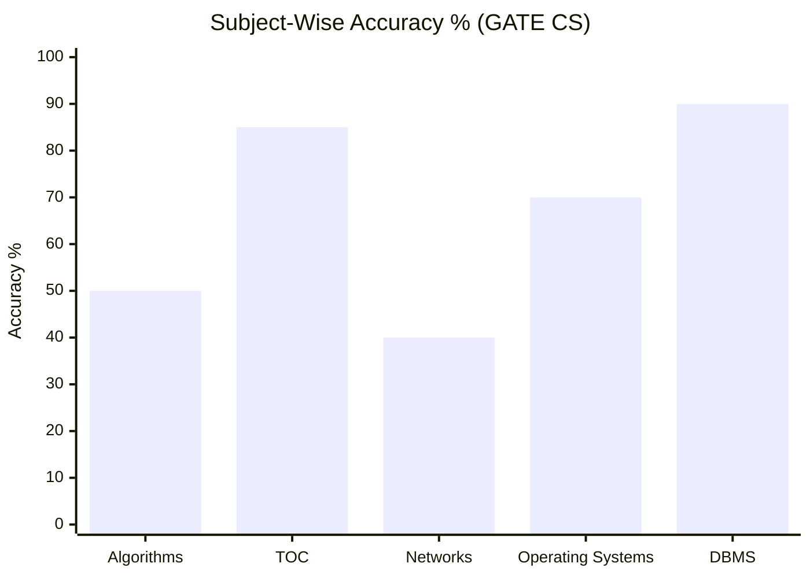
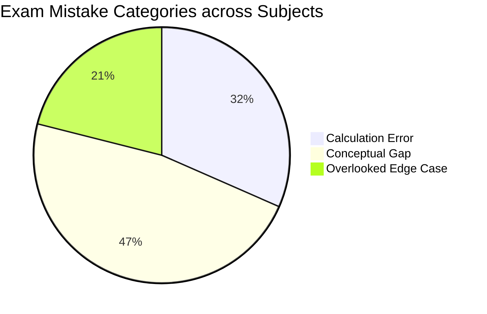
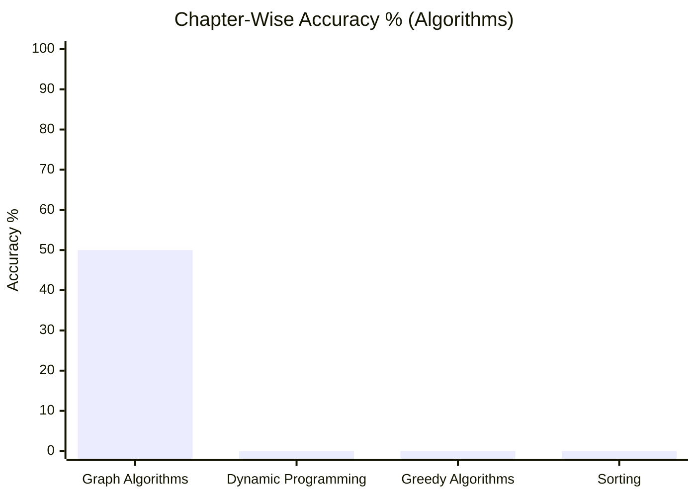
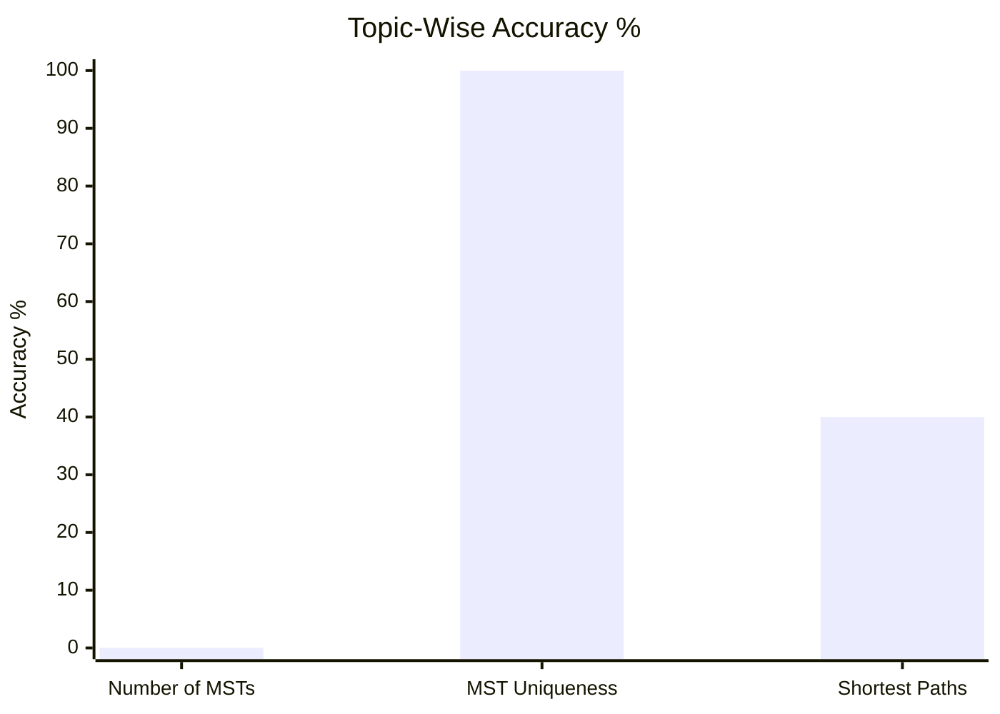

# Exam Analysis & Practice Master Skill (`exam-analysis-master`)

This skill empowers the AI to act as an exam coach and knowledge curator for competitive exams (e.g., **GATE**, **CDS**, or general learning), generating Obsidian-native notes exportable via **Quarto** or **Quartz**.

---

## 1. Vault Structure & Layout

```text
content/
├── exams_config.md                 # Registry of target exams & active subjects
└── [exam]/                         # e.g., gate-cs/ or cds/
    └── [subject]/                  # e.g., algorithms/
        ├── index.md                # Subject master index (Topics -> Questions & Direct Variations)
        ├── question_db.md          # Central Question & Taxonomy Database (Dataview compatible)
        ├── test_sessions/          # Log & Scorecards of Full Test PDF Sessions (includes link to source test file)
        ├── practice_sessions/      # Log of Haphazard Practice Sessions (screenshots, text, books, question numbers)
        ├── notes/                  # Core Topic Notes (Theory + Links)
        │   ├── questions/          # Modular Question Notes (Question + Derivation + Tier 1 Variations)
        │   └── variations/         # Modular Variation Notes (Tier 2 Topic & Tier 3 Chapter Variations)
        └── tmp/                    # Active session workspace
            └── [session_id]/       # Temporary session files
```

---

### Formatting Standards (KISS Principle)
1. **Crisp, Minimalist Titles (No Em-Dashes / No Fluff)**:
   - STRICTLY FORBID em-dashes (`—`), buzzwords (`Master Dashboard`, `Executive Hub`, `Overview`), and bloated title headers.
   - Apply KISS (Keep It Simple, Stupid):
     - Exam Index: `# GATE CS`
     - Subject Index: `# Algorithms`
     - Topic Note: `# Counting MSTs`
     - Question Note: `# GATE 2021 Q34`
     - Variations Note: `# Counting MSTs Variations`
2. **Clean Wikilinks (Descriptive Labels, No `/index` Raw Paths)**:
   - Always display clean topic/subject names for wikilinks: `[[content/gate-cs/algorithms/index|Algorithms]]`.
   - Never display raw `/index` or `/question_db` in link text.
   - Do NOT place `❌` or `✅` icons next to topics on index pages.
3. **Collapsible Solutions (`> [!faq]- View Solution`)**:
   - ALWAYS use native Obsidian Callout foldables for collapsible solutions/hints.
4. **Centered Display Math**: Use `$$ ... $$` separated by blank lines for math formulas.
5. **Obsidian Frontmatter**: Every note tracks metadata in frontmatter without body duplication:
   ```yaml
   ---
   exam: "GATE CS"
   subject: "Algorithms"
   topic: "Minimum Spanning Trees"
   subtopic: "Number of MSTs"
   question_type: "Formulaic Edge Conditions"
   source: "GATE CS 2021 Set 1 Q34"
   source_file_link: "[[content/gate-cs/algorithms/test_sessions/2026-09-03_mock_03|Mock Test 03 PDF]]"
   question_number: "Q34"
   status: "Wrong"
   mistake_category: "Calculation Error"
   tags: [gate-cs, algorithms, mst]
   date: 2026-09-03
   ---
   ```

---

## 3. 3-Tier Visual Performance Graphs & Analytics Architecture

The system automatically embeds clean `xychart-beta` bar charts and `pie` charts across three hierarchical levels:

### Tier 1: Exam-Level Dashboard (`content/[exam]/index.md`)
Visualizes overall performance across all subjects within an exam:
1. **Subject-Wise Accuracy Bar Chart**:

2. **Exam-Wide Mistake Breakdown Pie Chart**:


### Tier 2: Subject-Level Dashboard (`content/[exam]/[subject]/index.md`)
Visualizes chapter and topic performance within a specific subject:
1. **Chapter-Wise Accuracy Bar Chart**:

2. **Topic-Wise Accuracy Bar Chart**:


### Tier 3: Database & Session Level (`question_db.md` & `test_sessions/`)
1. **Mistake Distribution Pie Chart**: Breakdown of lost marks by mistake category.
2. **Test Score Trendline**: Score progression across sequential mock test attempts.

---

## 4. Two Modes of Session Logging & Ingest

### Mode A: Full Test PDF Walkthrough (`test_sessions/`)
- User provides a PDF of a test session given.
- AI logs summary scorecard + embedded Mermaid performance charts in `test_sessions/[date]_[test_name].md`.
- **Mandatory Link**: Must store explicit link to source PDF test file in frontmatter and summary note.

### Mode B: Haphazard Practice Session (`practice_sessions/`)
- User pastes text, screenshots, or questions from a book/source.
- AI logs session in `practice_sessions/[date]_[source_name].md`.
- **Question Number Tracking**: Inferred automatically (e.g. *CLRS Ex 23.2-1*, *Book Q14*). If ambiguous, AI MUST explicitly ask the user.

---

## 5. Interactive Practice Workflow

1. **Ingest & Taxonomy Breakdown**: Extract Exam, Year, Question Number, Subject, Topic, Subtopic, Specialization.
2. **Evaluation & Explanation**: Root cause, intuition, theorems, step-by-step derivation, and mistake category.
3. **Generate Novel Variations (3 Tiers)**:
   - **Tier 1 (Direct Question Variation)**: Placed in `notes/questions/[question_slug].md`.
   - **Tier 2 (Topic Variation)**: Placed in `notes/variations/[topic_slug]_variations.md`.
   - **Tier 3 (Chapter Variation)**: Placed in `notes/variations/[variation_slug].md` and linked directly under `Chapter Variations` in `index.md`.

---

## 6. Modular Note Architecture & Automatic Graph Embeds (`/wrap`)

When user types `/wrap`, the AI automatically updates the vault AND embeds live visual analytics charts directly into the files:

1. **Question Database ([`question_db.md`](file:///home/skc/dev/SAGE/content/gate-cs/algorithms/question_db.md))**:
   - Embeds the **Mistake Category Pie Chart** and **Topic Accuracy Heatmap** at the top of the database page.
2. **Subject Index ([`index.md`](file:///home/skc/dev/SAGE/content/gate-cs/algorithms/index.md))**:
   - Embeds the **Subject Mastery Heatmap** at the top of the index page.
3. **Test Scorecards (`test_sessions/`)**:
   - Embeds the **Test Score Trendline** and accuracy breakdown chart.
4. **Question Notes (`notes/questions/[question_slug].md`)**:
   - Original question statement in blockquote + collapsible derivation (`> [!faq]- View Solution & Derivation`) + Tier 1 variations + direct test PDF link.
5. **Variation Notes (`notes/variations/[variation_slug].md`)**:
   - Dedicated variation problems with collapsible solutions (`> [!faq]- View Solution`).
6. **Topic Notes (`notes/[topic_slug].md`)**:
   - Core theory + index of links to Question Notes and Topic Variation Notes.

---

## 7. Analytics Commands

- `/report [subject/topic]` $\rightarrow$ Renders accuracy ratio, Mistake Category Pie Chart, Topic Accuracy Heatmap, and actionable weak area advice.
- `/analyze [subject/topic/exam]` $\rightarrow$ Renders exam weightage distribution, trap patterns, and high-yield focus topics with visual charts.
