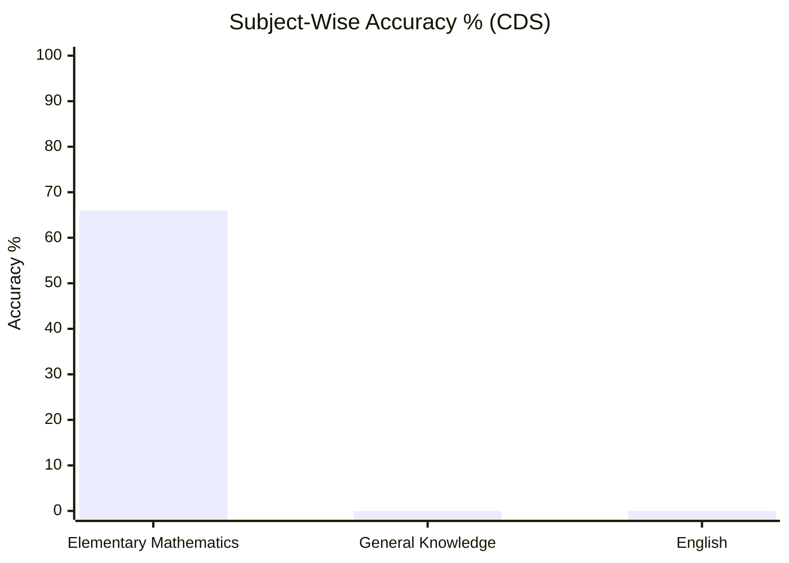
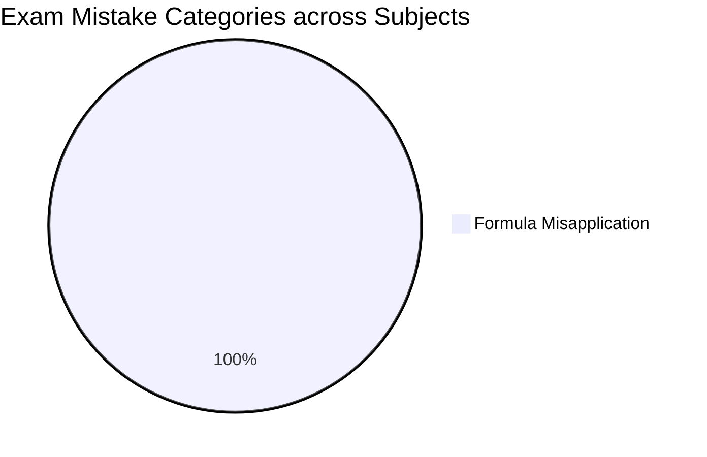
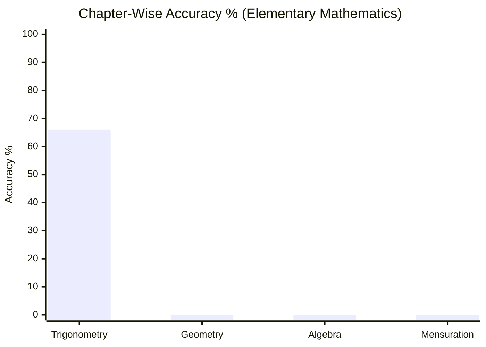
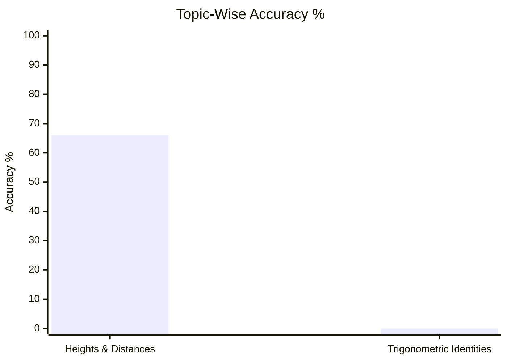

# Exam Analysis & Practice Master Skill (`exam-analysis-master`)

This skill empowers the AI to act as an exam coach and knowledge curator for competitive exams (e.g., **GATE**, **CDS**, or general learning), generating Obsidian-native notes exportable via **Quarto** or **Quartz**.

---

## 1. Vault Structure & Layout

```text
content/
├── exams_config.md                 # Master Exams Registry
└── [exam]/                         # e.g., gate-cs/ or cds/
    ├── gate_cs_overview.md         # Exam Overview Dashboard (Subject Bar Charts & Mistake Pie Charts)
    └── [subject]/                  # e.g., algorithms/ or elementary-mathematics/
        ├── algorithms_overview.md  # Subject Overview Dashboard (Chapter & Topic Bar Charts)
        ├── question_db.md          # Central Question Taxonomy Database (Dynamic Dataview Queries)
        ├── test_sessions/          # Full Test Scorecards (Obsidian Properties / YAML Frontmatter)
        ├── practice_sessions/      # Book/Screenshot Practice Session Logs
        └── notes/                  # Core Topic Notes (Theory + Direct Links to Variations)
            ├── questions/          # Modular Question Notes (Question + Derivation + Tier 1 Variations)
            └── variations/         # Modular Variation Notes (Tier 2 Topic & Tier 3 Chapter Variations)
```

---

### Formatting & Metadata Standards

1. **Crisp, Minimalist Titles (STRICTLY NO Em-Dashes, Hyphens, or AI Fluff)**:
   - STRICTLY FORBID em-dashes (`—`), hyphens (`-`), buzzwords (`Master Dashboard`, `Executive Hub`, `Overview`, `Theory & Concept Notes`), and bloated header titles.
   - Headers MUST BE concise, raw names without extra text:
     - Exam Index: `# CDS` (NOT `# CDS Overview` or `# CDS — Overview`)
     - Subject Index: `# Elementary Mathematics` (NOT `# Elementary Mathematics Overview`)
     - Question Database: `# Question Database` (NOT `# Question Database - Elementary Mathematics` or `# Question DB — Algorithms`)
     - Topic Note: `# Heights and Distances` (NOT `# Heights and Distances - Theory & Concept Notes`)
     - Question Note: `# GATE 2021 Q34` or `# CDS 2024 Q13`
     - Test Session: `# 2026-09-03 CDS Mock 01` (NOT `# Test Session: 2026-09-03 CDS Mock 01`)

2. **Obsidian Frontmatter & Properties (MANDATORY)**:
   - ALL test session scorecards and question notes MUST store metadata strictly in frontmatter YAML properties, NEVER as bullet points in the markdown body:
   ```yaml
   ---
   exam: "CDS"
   subject: "Elementary Mathematics"
   topic: "Trigonometry"
   subtopic: "Heights and Distances"
   date: 2026-09-03
   source_file: "cds_2024_math_mock1.pdf"
   source_file_link: "[[content/cds/elementary-mathematics/test_sessions/2026-09-03_cds_mock_01|Mock Test 01]]"
   total_questions: 3
   correct: 2
   wrong: 1
   accuracy: 66.67
   tags: [cds, elementary-mathematics, trigonometry]
   ---
   ```

3. **Dynamic Obsidian Dataview Queries for Tables (MANDATORY)**:
   - Question Databases (`question_db.md`) MUST use Obsidian `dataview` codeblocks to render dynamic question logs automatically instead of hardcoded markdown tables:
   ```markdown
   ## Dynamic Question Log

   ```dataview
   TABLE 
       rows.question_type AS "Question Types / Specializations",
       rows.file.link AS "Logged Question Notes",
       rows.status AS "Status",
       rows.mistake_category AS "Mistake Category"
   FROM "content/cds/elementary-mathematics/notes/questions"
   GROUP BY topic + " > " + subtopic AS "Topic & Subtopic"
   ```
   ```

4. **Direct Variation Links (STRICTLY NO Intermediate Variation Indexes)**:
   - In topic notes and overview pages (`## Chapter Variations`), link DIRECTLY to specific variation files (e.g. `[[content/cds/elementary-mathematics/notes/variations/trigonometry_chapter_variations|Trigonometry Chapter Variations]]` or direct variation notes). Never link to non-existent or intermediate variation indexes.

5. **Collapsible Solutions (`> [!faq]- View Solution`)**:
   - ALWAYS use native Obsidian Callout foldables for collapsible solutions/hints.

6. **Centered Display Math**: Use `$$ ... $$` separated by blank lines for math formulas.

---

## 3. Visual Performance Analytics (Subject Bar Charts & Pie Charts)

The system automatically embeds clean `xychart-beta` bar charts and `pie` charts across all three levels:

### Tier 1: Exam-Level Dashboard (`content/[exam]/[exam]_overview.md`)



### Tier 2: Subject-Level Dashboard (`content/[exam]/[subject]/[subject]_overview.md`)



---

## 4. Section Order Standard

Overview pages MUST follow this exact vertical order:
1. `# [Title]`
2. `## Topics & Notes` / `## Subjects`
3. `## Chapter Variations`
4. `## Performance Overview` *(Subject/Chapter/Topic Bar Charts & Mistake Pie Charts)*
5. `## Navigation`

---

## 5. Analytics Commands

- `/wrap` $\rightarrow$ Relocates questions, updates dataview queries, embeds visual charts, and updates frontmatter properties.
- `/report [subject/topic]` $\rightarrow$ Renders accuracy ratio, Mistake Category Pie Chart, Topic Accuracy Heatmap, and actionable weak area advice.
- `/analyze [subject/topic/exam]` $\rightarrow$ Renders exam weightage distribution, trap patterns, and high-yield focus topics with visual charts.
