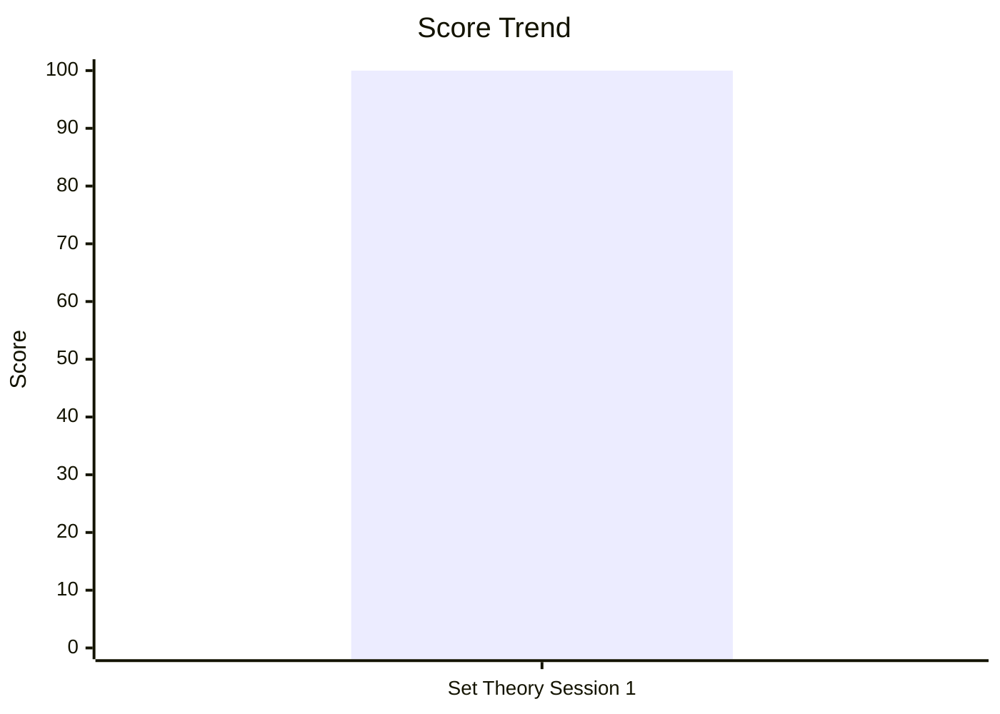
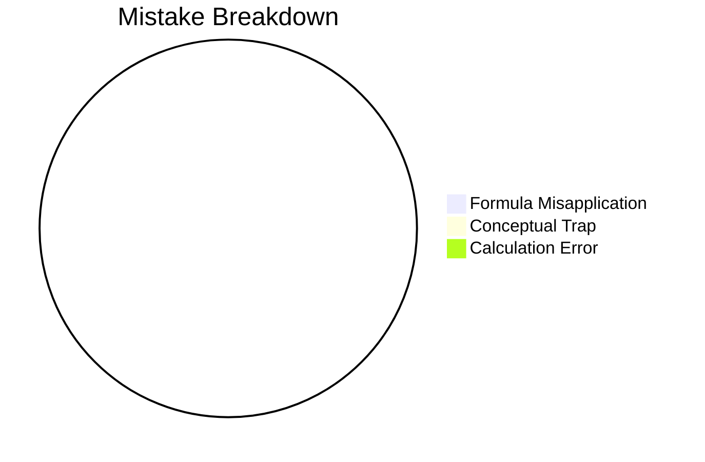

# CDS Examination

## Performance Overview

## Navigation
- [[cds/math/math_overview|Elementary Mathematics]]
- [[cds/physics/physics_overview|Physics]]
- [[cds/economy/economy_overview|Indian Economy]]
- [[cds/geography/geography_overview|Geography]]
- [[cds/polity/polity_overview|Indian Polity]]
- [[cds/gk/gk_overview|General Knowledge]]

