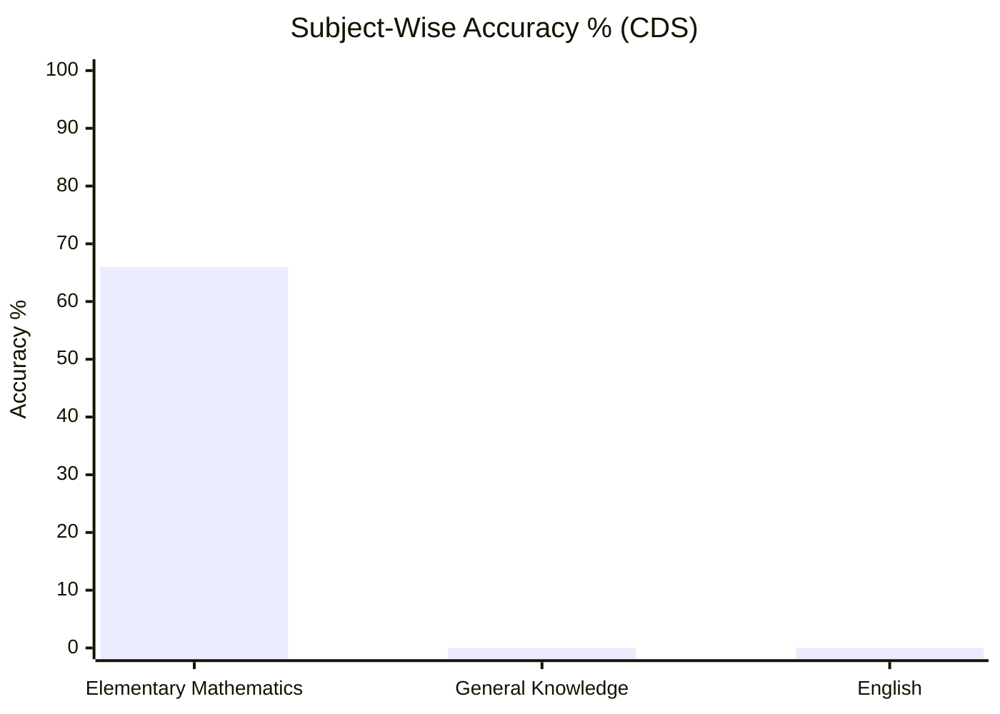
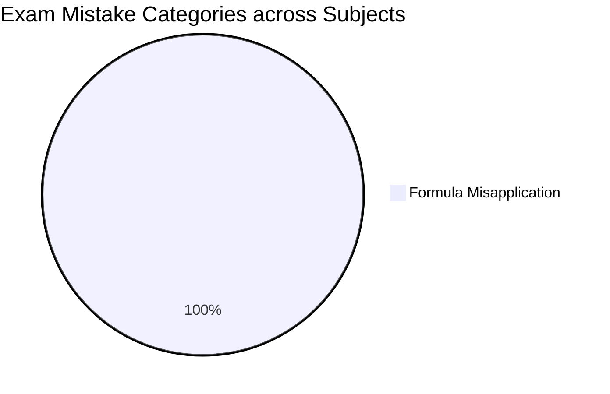

# CDS

## Subjects
- [[content/cds/elementary-mathematics/elementary_mathematics_overview|Elementary Mathematics]]

## Performance Overview

## Navigation
- [[content/exams_config|Master Exams Registry]]
