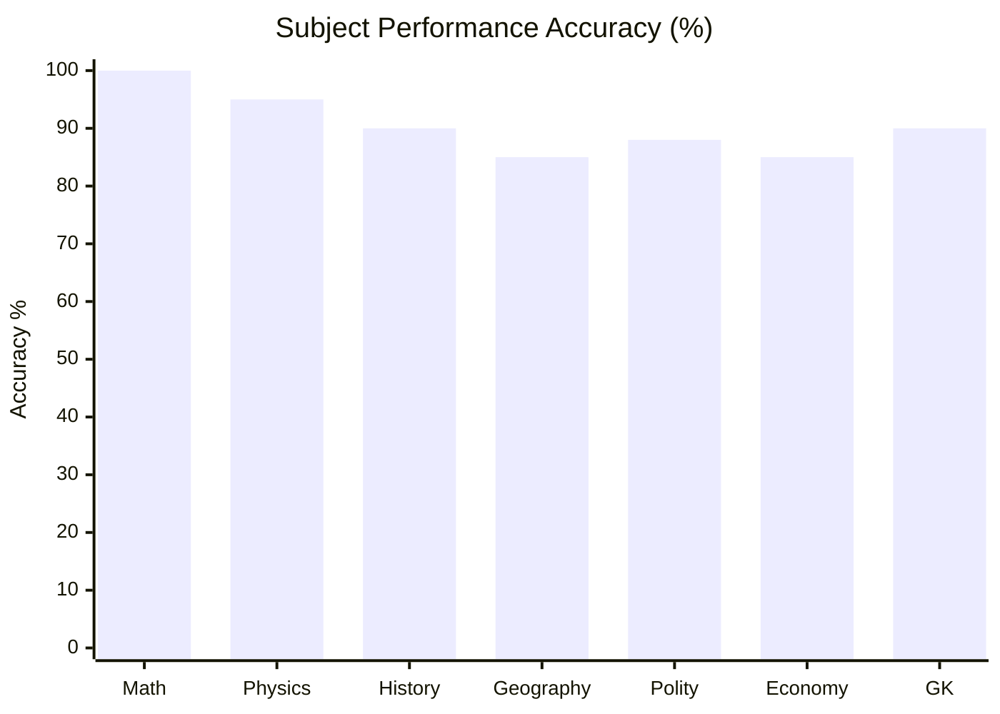
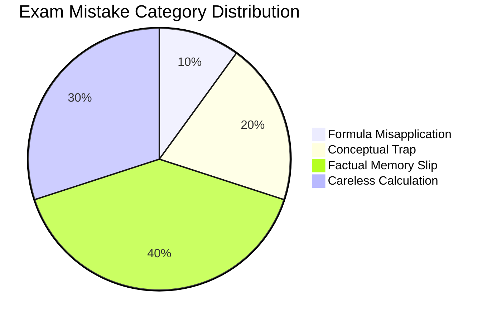

# CDS Examination Master Dashboard

Welcome to the **Combined Defence Services (CDS)** Master Study Vault. Below is the complete catalog of subject overviews and structured chapter notes with explicit chapter numbers.

---

## 1. Elementary Mathematics
- **Subject Overview**: [[cds/math/math_overview|Elementary Mathematics Subject Overview]]
- **Chapter Notes**:
  - [[cds/math/notes/numbers|Ch 01. Number System]]
  - [[cds/math/notes/sequence_series|Ch 02. Sequence and Series]]
  - [[cds/math/notes/hcf_lcm|Ch 03. HCF and LCM of Numbers]]
  - [[cds/math/notes/modular|Ch 04. Modular Arithmetic & Remainders]]
  - [[cds/math/notes/roots|Ch 05. Square Roots and Cube Roots]]
  - [[cds/math/notes/time_distance|Ch 06. Time and Distance]]
  - [[cds/math/notes/work|Ch 07. Time and Work]]
  - [[cds/math/notes/percentage|Ch 08. Percentage]]
  - [[cds/math/notes/simple_interest|Ch 09. Simple Interest]]
  - [[cds/math/notes/profit_loss|Ch 11. Profit and Loss]]
  - [[cds/math/notes/ratio_proportion|Ch 12. Ratio and Proportion]]
  - [[cds/math/notes/polynomial_hcf_lcm|Ch 15. HCF and LCM of Polynomials]]
  - [[cds/math/notes/rational_expressions|Ch 16. Rational Expressions]]
  - [[cds/math/notes/linear_equations|Ch 17. Linear Equations]]
  - [[cds/math/notes/quadratic_equations|Ch 18. Quadratic Equations & Inequalities]]
  - [[cds/math/notes/set_theory|Ch 19. Set Theory]]
  - [[cds/math/notes/trigonometry|Ch 20. Measurements of Angles and Trigonometric Ratios]]
  - [[cds/math/notes/heights|Ch 21. Height and Distance]]
  - [[cds/math/notes/heights_distances|Ch 22. Heights and Distances]]
  - [[cds/math/notes/triangles|Ch 23. Triangles]]
  - [[cds/math/notes/quadrilateral|Ch 24. Quadrilateral and Polygon]]
  - [[cds/math/notes/circle|Ch 25. Circle]]
  - [[cds/math/notes/solids|Ch 27. Surface Area and Volume of Solids]]
  - [[cds/math/notes/statistics|Ch 28. Statistics]]

---

## 2. Physics
- **Subject Overview**: [[cds/physics/physics_overview|Physics Subject Overview]]
- **Master Formula Sheet**: [[cds/physics/notes/formulas|Master Physics Formulas & Definitions]]
- **Chapter Notes**:
  - [[cds/physics/notes/mechanics|Ch 01. Mechanics & Dynamics]]
  - [[cds/physics/notes/gravitation|Ch 02. Gravitation & Rotational Motion]]
  - [[cds/physics/notes/properties_of_matter|Ch 03. Properties of Matter & Fluid Mechanics]]
  - [[cds/physics/notes/heat_thermodynamics|Ch 04. Heat & Thermodynamics]]
  - [[cds/physics/notes/waves_oscillations|Ch 05. Oscillations, SHM & Waves]]
  - [[cds/physics/notes/optics|Ch 06. Optics & Optical Instruments]]
  - [[cds/physics/notes/electricity_magnetism|Ch 07. Electricity & Magnetism]]
  - [[cds/physics/notes/modern_physics|Ch 08. Modern Physics & Communication Systems]]

---

## 3. History
- **Master Cheat Sheet**: [[cds/history_cheatsheet|Ultimate Comprehensive History Cheat Sheet]]
- **Chapter Breakdown**:
  - [[cds/history_cheatsheet#part-1-ancient-india-pre-history-to-1200-ad|Ch 01. Ancient India (Pre-History to ~1200 AD)]]
  - [[cds/history_cheatsheet#part-2-medieval-india-7501707-ad|Ch 02. Medieval India (750–1707 AD)]]
  - [[cds/history_cheatsheet#part-3-modern-india--indian-national-movement-17071947-ad|Ch 03. Modern India & Freedom Struggle (1707–1947 AD)]]
  - [[cds/history_cheatsheet#part-4-world-history|Ch 04. World History (Revolutions, WWI & WWII)]]
  - [[cds/history_cheatsheet#part-5-art-architecture--culture-quick-reference|Ch 05. Art, Architecture & Culture Quick-Reference]]

---

## 4. Geography
- **Subject Overview**: [[cds/geography/geography_overview|Geography Subject Overview]]
- **Chapter Notes**:
  - [[cds/geography/notes/universe_earth|Ch 01. Physical & World Geography - Universe & Earth]]

---

## 5. Indian Polity
- **Subject Overview**: [[cds/polity/polity_overview|Indian Polity Subject Overview]]
- **Chapter Notes**:
  - [[cds/polity/notes/polity_cheatsheet|Ch 01. Indian Polity Master Cheat Sheet (Acts, Committees, Amendments, Articles)]]

---

## 6. Indian Economy
- **Subject Overview**: [[cds/economy/economy_overview|Indian Economy Subject Overview]]
- **Chapter Notes**:
  - [[cds/economy/notes/economy_cheatsheet|Ch 01. Indian Economy Master Cheat Sheet (Plans, Banking, HDI & Institutions)]]

---

## 7. General Knowledge
- **Subject Overview**: [[cds/gk/gk_overview|General Knowledge Subject Overview]]
- **Chapter Notes**:
  - [[cds/gk/notes/gk|Ch 01. Indian General Knowledge (Firsts, Defense, Space, Awards & Honours)]]

---

## Performance Overview

---

## Navigation
- [[index|SAGE Home]]
