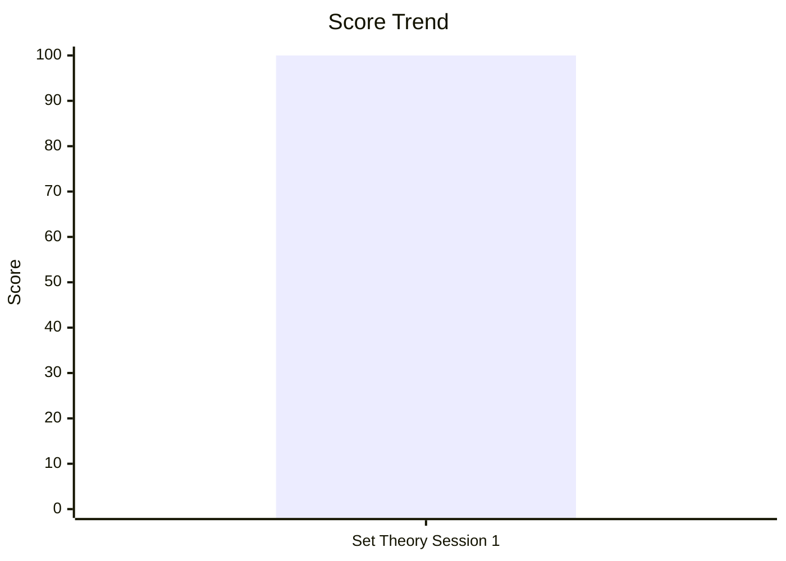
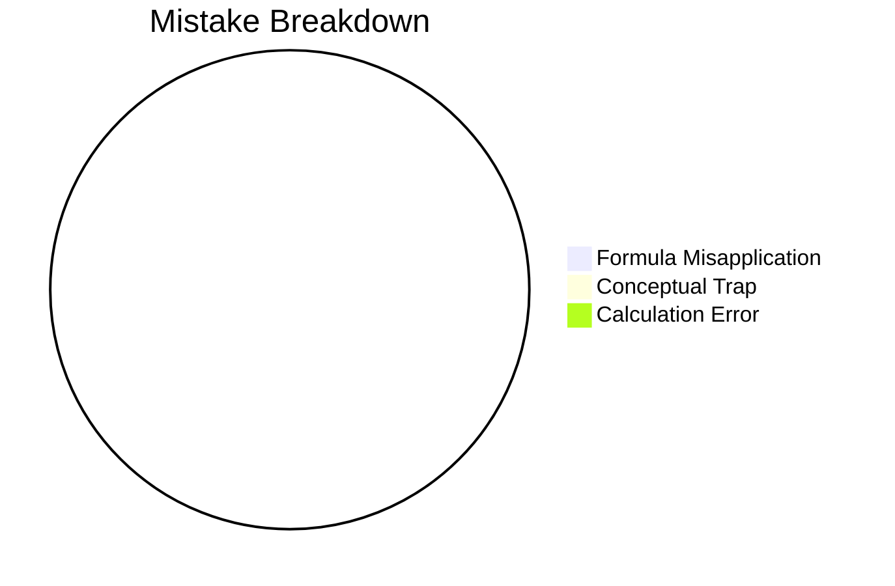

# CDS Examination

## Performance Overview

## Navigation
- [[content/cds/math/math_overview|Elementary Mathematics]]
- [[content/cds/physics/physics_overview|Physics]]
- [[content/cds/economy/economy_overview|Indian Economy]]
- [[content/cds/geography/geography_overview|Geography]]

