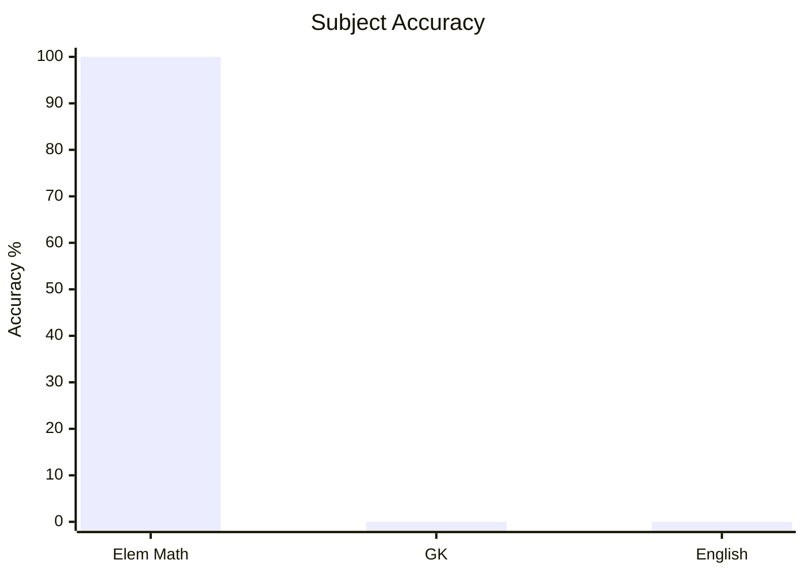
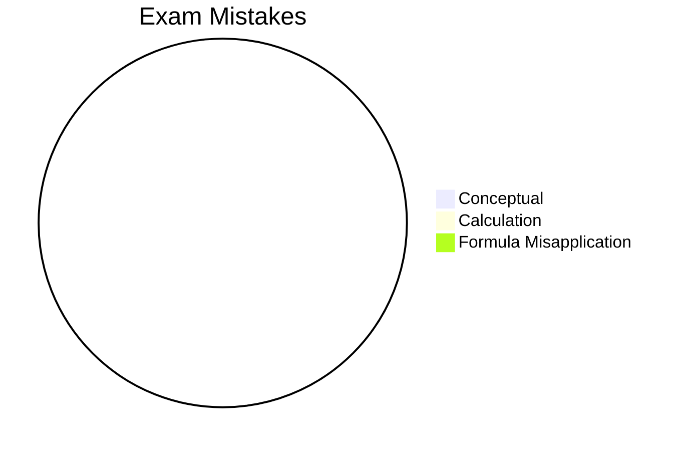

# CDS

## Subjects

- [[cds/elementary-mathematics/math_overview|Elementary Mathematics]]
- [[cds/general-knowledge/general_knowledge_overview|General Knowledge]]
- [[cds/english/english_overview|English]]

## Performance Overview

## Navigation

- [[exams_config|Exams Config]]
