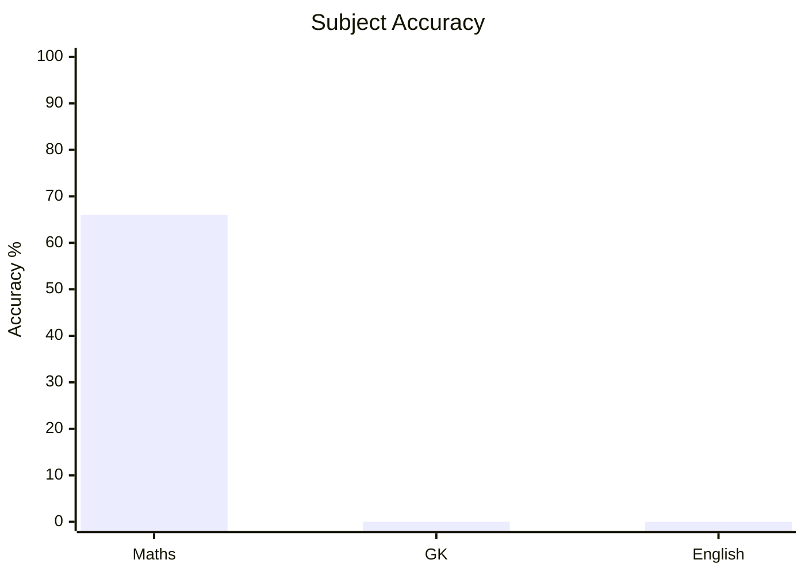
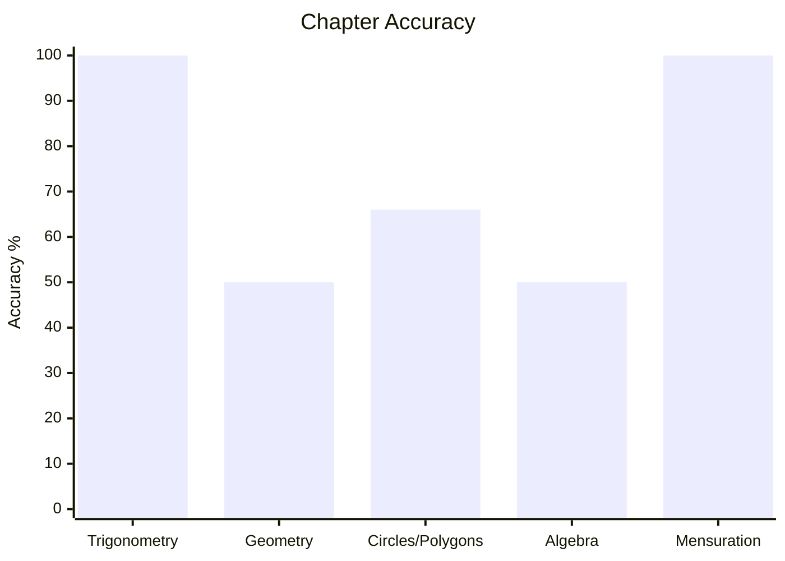
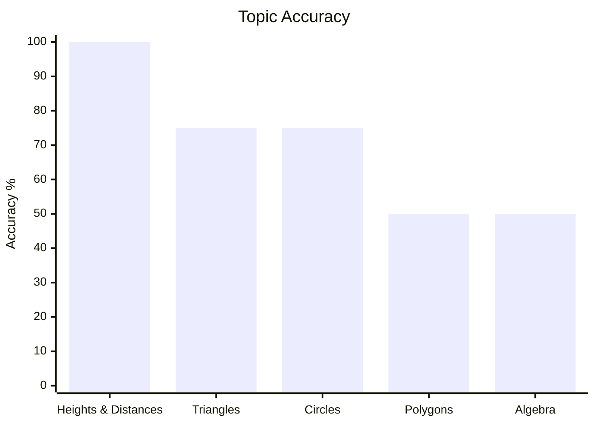
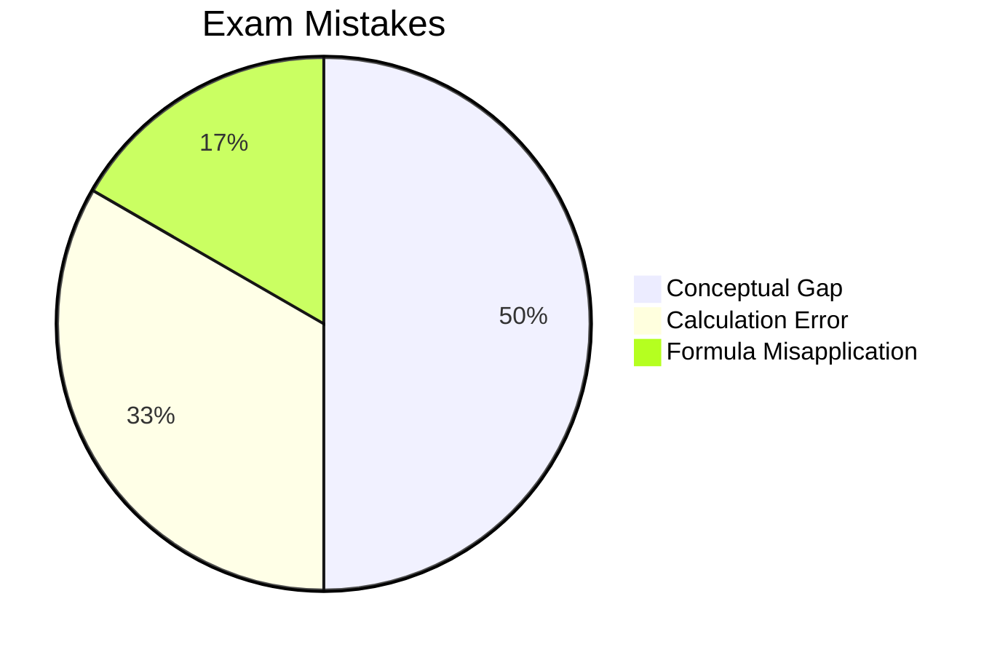

# CDS

## Subjects
- [[content/cds/elementary-mathematics/elementary_mathematics_overview|Elementary Mathematics]]

## Performance Overview

### 1. Subject-Wise Accuracy

### 2. Chapter-Wise & Topic-Wise Accuracy

### 3. Exam Mistake Categories

## Navigation
- [[content/exams_config|Master Exams Registry]]
