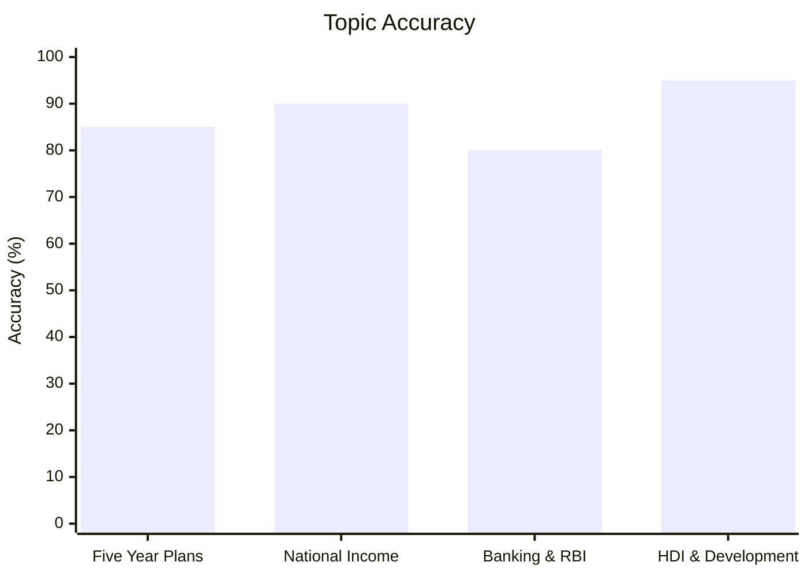
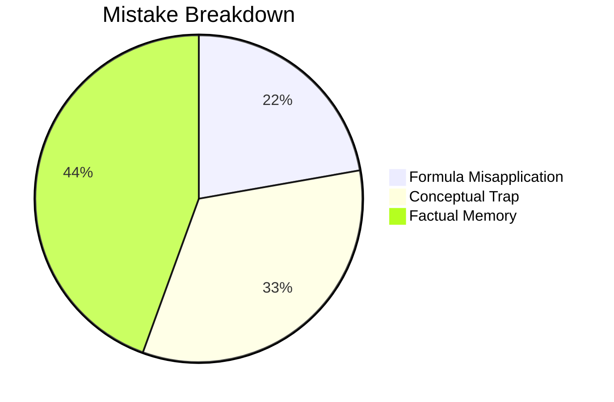

# Indian Economy

## Topics & Notes
- [[cds/economy/notes/economy_cheatsheet|Indian Economy Cheat Sheet (Names, Events, Plans & Institutions)]]

## Performance Overview

## Navigation
- [[cds/cds_overview|CDS Overview Dashboard]]
