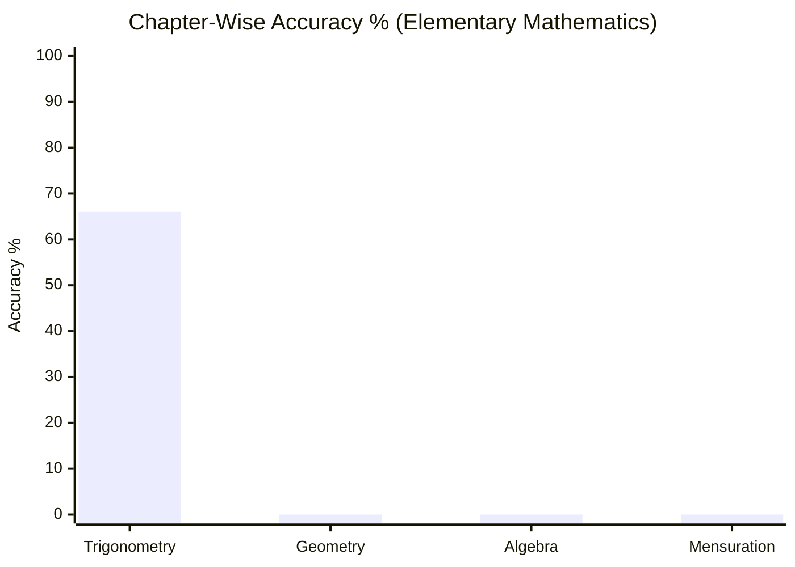
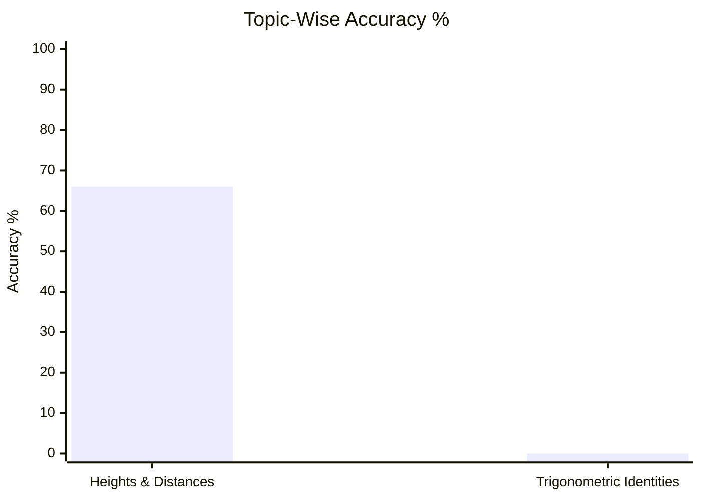
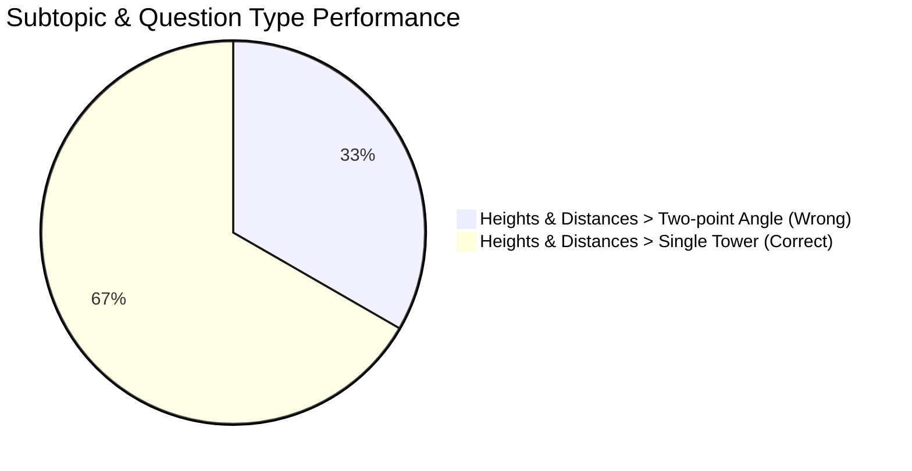

# Elementary Mathematics

## Topics & Notes
- [[content/cds/elementary-mathematics/notes/trigonometry_identities|Heights and Distances]]

## Chapter Variations
- [[content/cds/elementary-mathematics/notes/variations/trigonometry_chapter_variations|Trigonometry Chapter Variations]]

## Performance Overview

### Subtopic & Question Type Breakdown (Frequency & Status)

## Navigation
- [[content/cds/cds_overview|CDS]]
- [[content/cds/elementary-mathematics/question_db|Question Database]]
- [[content/exams_config|Master Exams Registry]]
