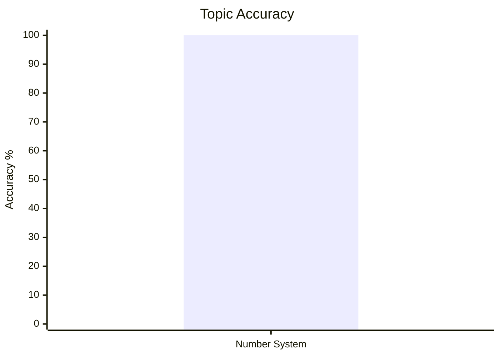
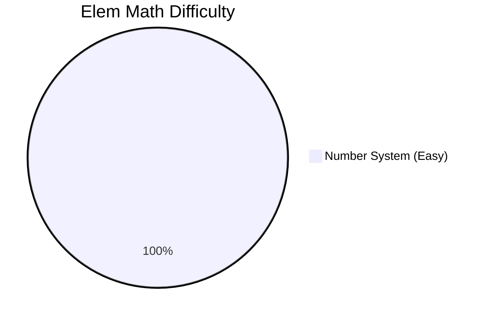
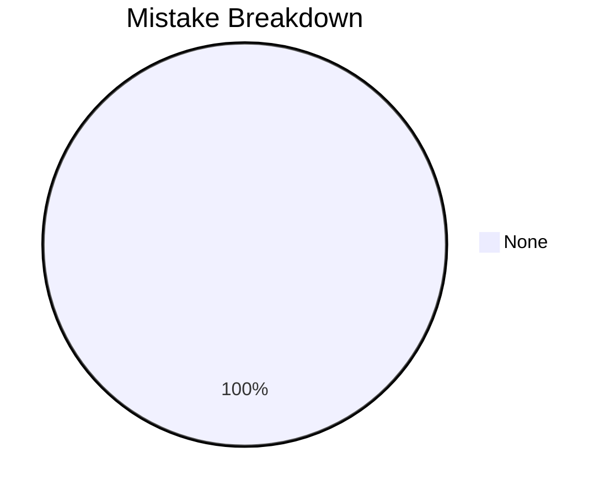

# Elementary Mathematics

## Topics & Notes

- [[cds/elementary-mathematics/notes/number_system|Number System]]

## Variations

- [[cds/elementary-mathematics/notes/variations/number_system_variations|Number System Variations]]

## Performance Overview

## Navigation

- [[cds/cds_overview|CDS Overview]]
- [[cds/elementary-mathematics/question_db|Question Database]]
