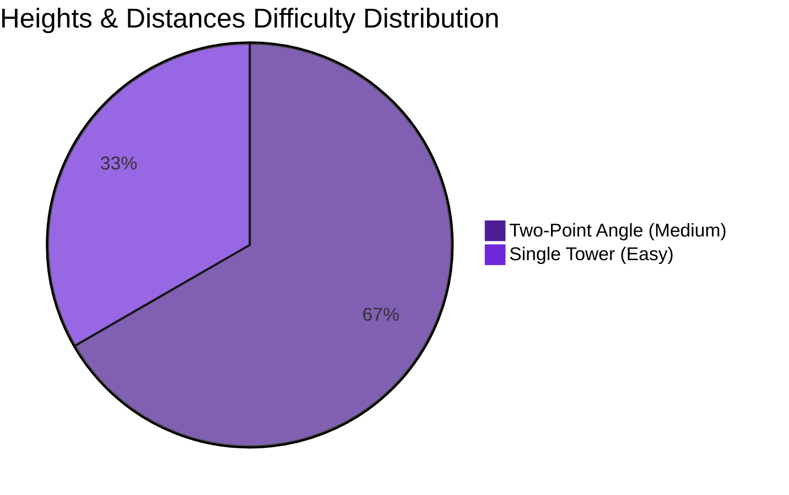

# Heights and Distances

## Theory, Intuition & Formulas

### Fundamental Intuition & Definitions
Heights and Distances applies basic right-angled triangle trigonometry to real-world geometric measurements:
- **Angle of Elevation**: The angle formed by the line of sight with the horizontal plane when viewing an object above horizontal level.
- **Angle of Depression**: The angle formed by the line of sight with the horizontal plane when viewing an object below horizontal level.

$$\tan(\theta) = \frac{\text{Perpendicular}}{\text{Base}} = \frac{h}{d}$$

### Standard Values & Key Identities
- $\tan(30^\circ) = \frac{1}{\sqrt{3}}$, $\tan(45^\circ) = 1$, $\tan(60^\circ) = \sqrt{3}$
- $\tan(15^\circ) = 2 - \sqrt{3}$, $\tan(75^\circ) = 2 + \sqrt{3}$

---

## Subtopics & Specialized Questions

### Subtopic 1: Two-Point Angle of Elevation
Questions involving two observations of an object from different distances along a straight line:
- [[content/cds/elementary-mathematics/notes/questions/cds_2024_math_q13|CDS 2024 Q13]] (Cliff & Two Ships)

---

## Variations
- [[content/cds/elementary-mathematics/notes/variations/trigonometry_chapter_variations|Trigonometry Chapter Variations]]

---

## Performance Overview

---

## Navigation
- [[content/cds/elementary-mathematics/elementary_mathematics_overview|Elementary Mathematics]]
- [[content/cds/cds_overview|CDS]]
