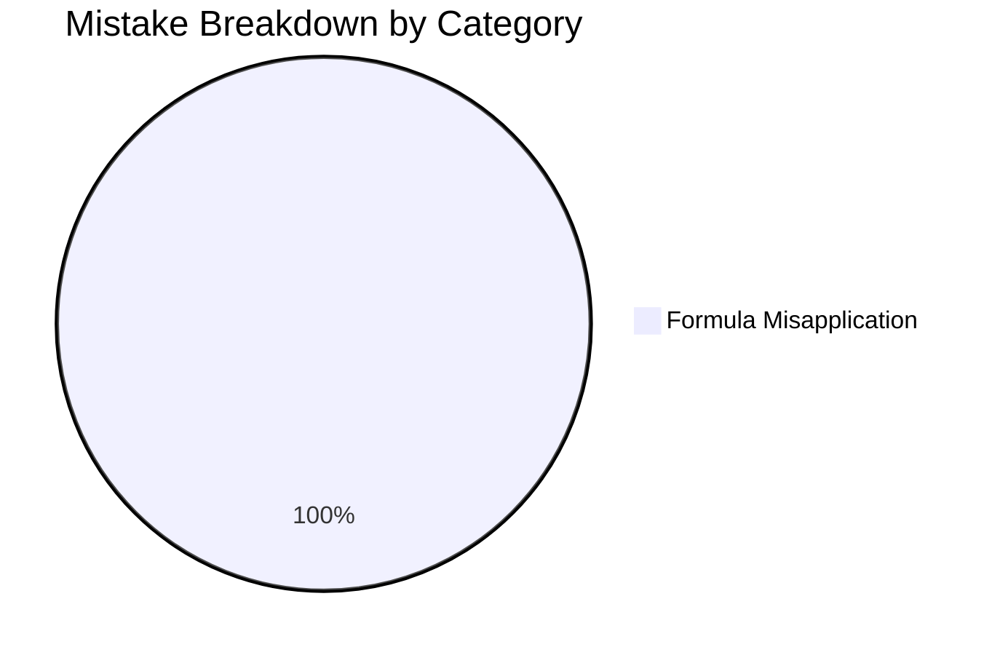

# Question Database - Elementary Mathematics

## Performance Breakdown

## Question Log

| Date | Source | Question ID | Topic | Status | Mistake Category | Link |
|---|---|---|---|---|---|---|
| 2026-09-03 | CDS 2024 I | Q12 | Heights & Distances | Correct | None | [[content/cds/elementary-mathematics/notes/questions/cds_2024_math_q12|CDS 2024 Q12]] |
| 2026-09-03 | CDS 2024 I | Q13 | Heights & Distances | Wrong | Formula Misapplication | [[content/cds/elementary-mathematics/notes/questions/cds_2024_math_q13|CDS 2024 Q13]] |
| 2026-09-03 | CDS 2024 I | Q14 | Heights & Distances | Correct | None | [[content/cds/elementary-mathematics/notes/questions/cds_2024_math_q14|CDS 2024 Q14]] |
