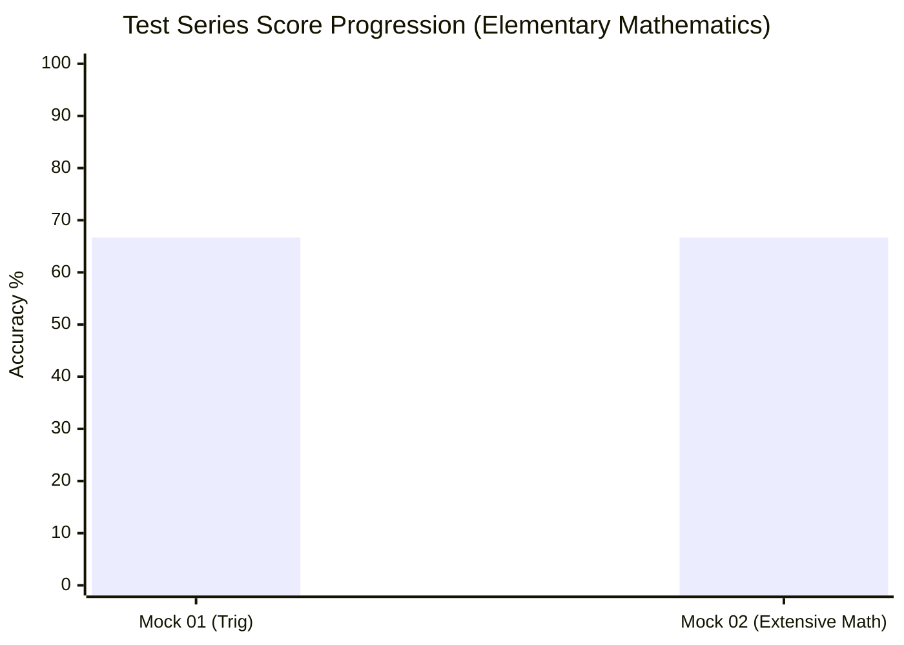
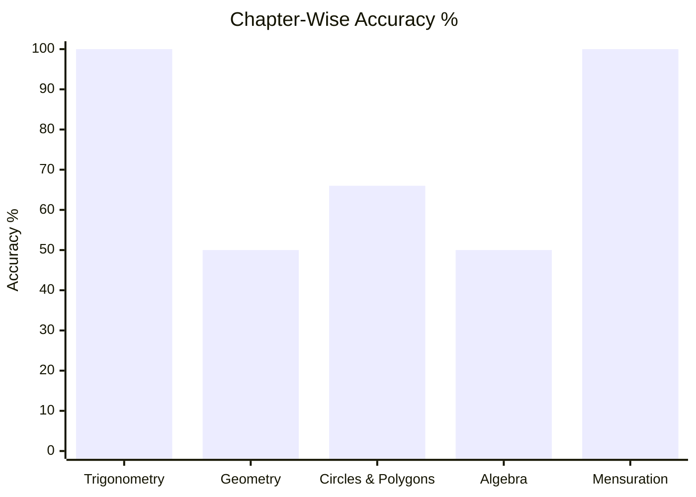
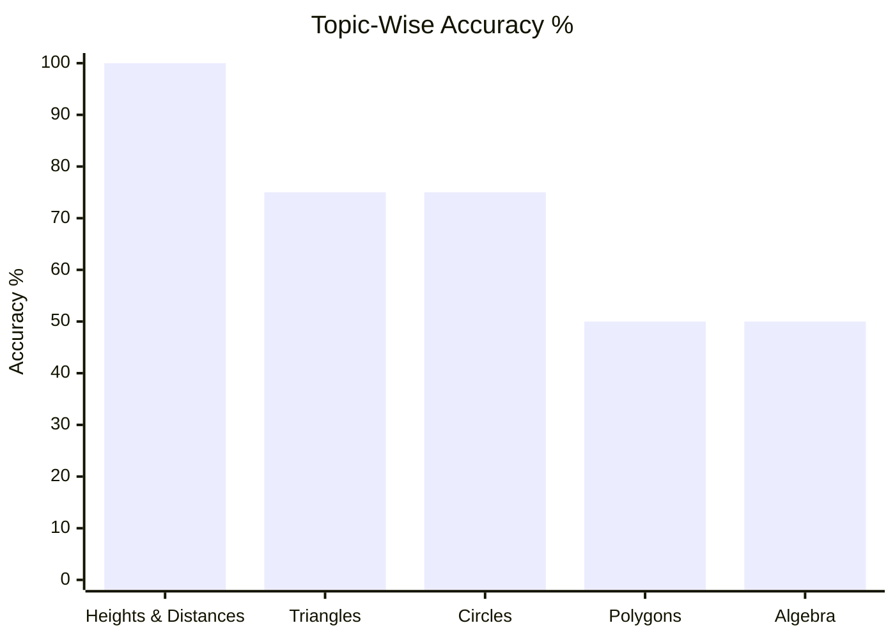
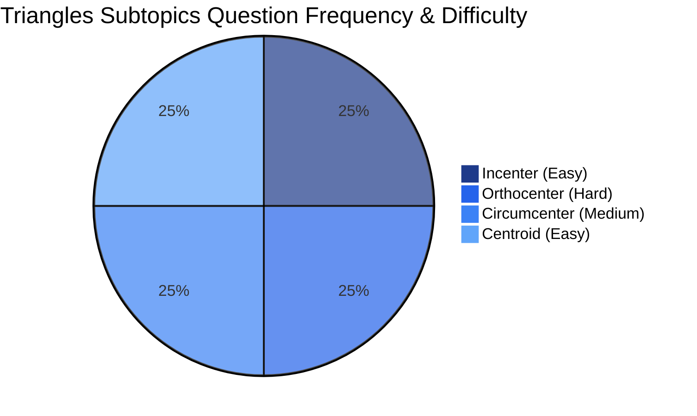
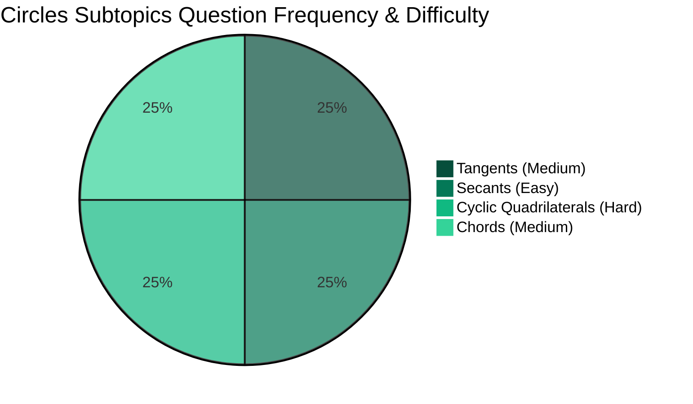
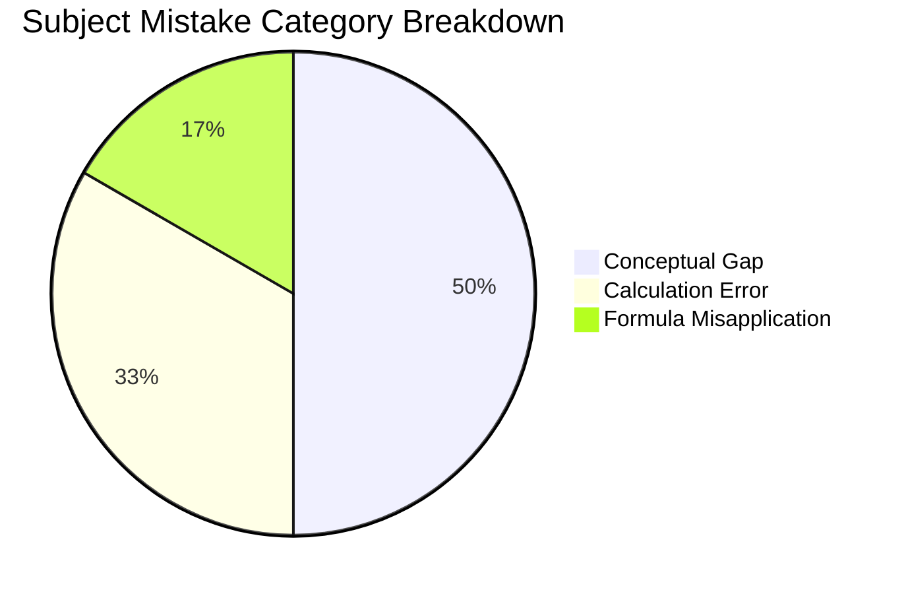

# Question Database

## Dynamic Question Log

```dataview
TABLE 
    rows.question_type AS "Question Types / Specializations",
    rows.file.link AS "Logged Question Notes",
    rows.difficulty AS "Difficulty",
    rows.status AS "Status",
    rows.mistake_category AS "Mistake Category"
FROM "content/cds/elementary-mathematics/notes/questions"
GROUP BY topic + " > " + subtopic AS "Topic & Subtopic"
```

---

## Performance Overview

### 1. Test Series Marks Trendline


### 2. Chapter-Wise & Topic-Wise Accuracy




### 3. Subtopic Question Frequency & Difficulty Distribution




### 4. Mistake Breakdown by Category


---

## Navigation
- [[content/cds/elementary-mathematics/elementary_mathematics_overview|Elementary Mathematics]]
- [[content/cds/cds_overview|CDS]]
