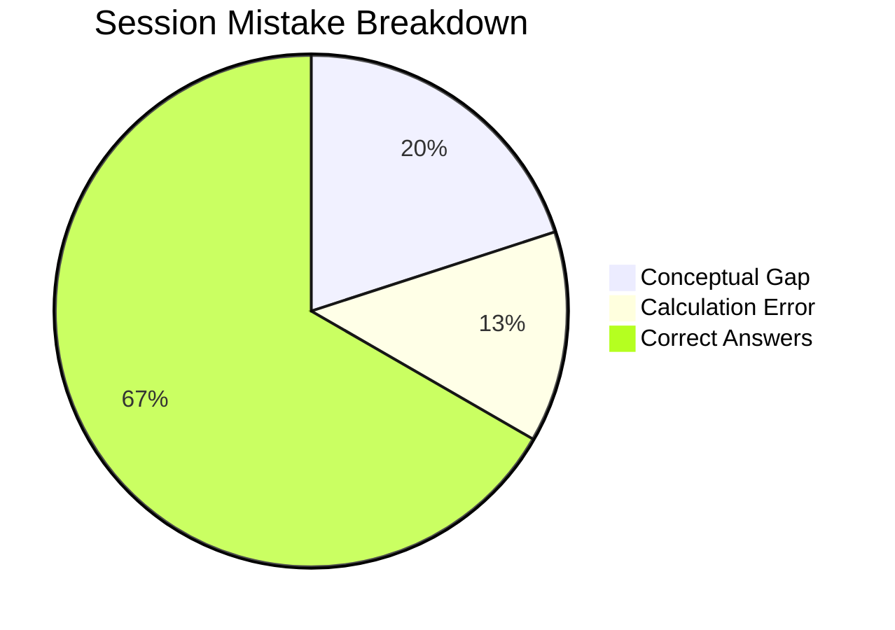

# 2026-09-03 CDS Math Extensive Mock

## Scorecard Summary
- **Total Questions Attempted**: 15
- **Correct**: 10
- **Wrong**: 5
- **Accuracy**: 66.67%

## Performance Breakdown

## Detailed Log & Links
1. [[content/cds/elementary-mathematics/notes/questions/cds_2024_math_q01|CDS 2024 Q01 - Triangles > Incenter]]: ✅ Correct
2. [[content/cds/elementary-mathematics/notes/questions/cds_2024_math_q02|CDS 2024 Q02 - Triangles > Orthocenter]]: ❌ Wrong (Conceptual Gap)
3. [[content/cds/elementary-mathematics/notes/questions/cds_2024_math_q03|CDS 2024 Q03 - Triangles > Circumcenter]]: ✅ Correct
4. [[content/cds/elementary-mathematics/notes/questions/cds_2024_math_q04|CDS 2024 Q04 - Triangles > Centroid]]: ✅ Correct
5. [[content/cds/elementary-mathematics/notes/questions/cds_2024_math_q05|CDS 2024 Q05 - Circles > Tangents]]: ❌ Wrong (Calculation Error)
6. [[content/cds/elementary-mathematics/notes/questions/cds_2024_math_q06|CDS 2024 Q06 - Circles > Secant Theorem]]: ✅ Correct
7. [[content/cds/elementary-mathematics/notes/questions/cds_2024_math_q07|CDS 2024 Q07 - Circles > Cyclic Quadrilaterals]]: ❌ Wrong (Conceptual Gap)
8. [[content/cds/elementary-mathematics/notes/questions/cds_2024_math_q08|CDS 2024 Q08 - Circles > Chords Intersecting]]: ✅ Correct
9. [[content/cds/elementary-mathematics/notes/questions/cds_2024_math_q09|CDS 2024 Q09 - Polygons > Interior Angles Sum]]: ✅ Correct
10. [[content/cds/elementary-mathematics/notes/questions/cds_2024_math_q10|CDS 2024 Q10 - Polygons > Number of Diagonals]]: ❌ Wrong (Calculation Error)
11. [[content/cds/elementary-mathematics/notes/questions/cds_2024_math_q11|CDS 2024 Q11 - Trigonometry > Max/Min Values]]: ✅ Correct
12. [[content/cds/elementary-mathematics/notes/questions/cds_2024_math_q12|CDS 2024 Q12 - Trigonometry > Heights & Distances]]: ✅ Correct
13. [[content/cds/elementary-mathematics/notes/questions/cds_2024_math_q13|CDS 2024 Q13 - Algebra > Quadratic Discriminants]]: ❌ Wrong (Conceptual Gap)
14. [[content/cds/elementary-mathematics/notes/questions/cds_2024_math_q14|CDS 2024 Q14 - Algebra > Remainder Theorem]]: ✅ Correct
15. [[content/cds/elementary-mathematics/notes/questions/cds_2024_math_q15|CDS 2024 Q15 - Mensuration > Sphere Volume]]: ✅ Correct
