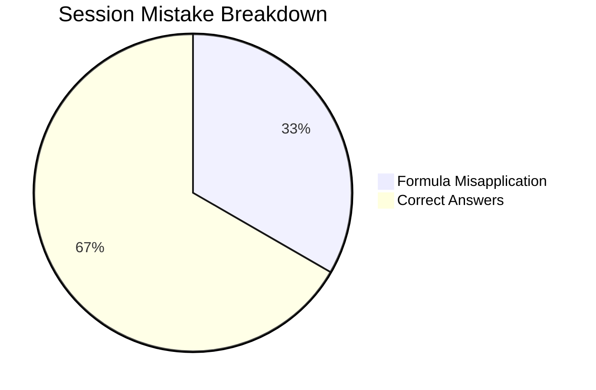

# 2026-09-03 CDS Mock 01

## Scorecard Summary
- **Total Questions Attempted**: 3
- **Correct**: 2
- **Wrong**: 1
- **Accuracy**: 66.67%

## Performance Breakdown

## Detailed Log & Links
1. [[content/cds/elementary-mathematics/notes/questions/cds_2024_math_q12|CDS 2024 Q12]]: ✅ Correct
2. [[content/cds/elementary-mathematics/notes/questions/cds_2024_math_q13|CDS 2024 Q13]]: ❌ Wrong (Formula Misapplication)
3. [[content/cds/elementary-mathematics/notes/questions/cds_2024_math_q14|CDS 2024 Q14]]: ✅ Correct
