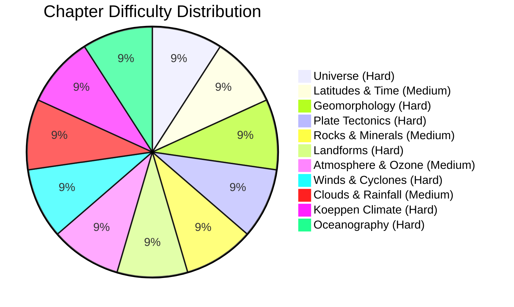

# Physical Geography

Welcome to the **Physical Geography Vault Index**. This master course covers all 11 core chapters extracted from the 251-page Physical Geography Master Class.

---

## Master Chapter Index

1. [[cds/geography/notes/universe|Ch 1. Universe and Solar System]]
2. [[cds/geography/notes/latitudes-longitudes|Ch 2. Latitudes, Longitudes and Time Systems]]
3. [[cds/geography/notes/geomorphology|Ch 3. Geomorphology and Earth Interior]]
4. [[cds/geography/notes/plate-tectonics|Ch 4. Plate Tectonics, Mountains and Volcanism]]
5. [[cds/geography/notes/rocks-minerals|Ch 5. Rocks, Minerals and Rock Cycle]]
6. [[cds/geography/notes/landforms|Ch 6. Geomorphic Processes and Landforms]]
7. [[cds/geography/notes/atmosphere-ozone|Ch 7. Atmosphere, Ozone Layer and Greenhouse Effect]]
8. [[cds/geography/notes/winds-cyclones|Ch 8. Pressure Belts, Local Winds and Cyclones]]
9. [[cds/geography/notes/clouds-rainfall|Ch 9. Condensation, Clouds and World Rainfall]]
10. [[cds/geography/notes/koeppen-climate|Ch 10. Koeppen Climate Classification and Indian Climate]]
11. [[cds/geography/notes/oceanography|Ch 11. Oceanography, Ocean Currents and Coral Reefs]]

---

## Question Taxonomy Database

- [[cds/geography/question_db|Physical Geography Central Question Database]]

---

## Performance Overview

---

## Navigation

- [[cds/cds_overview|CDS Exam Master Dashboard]]
