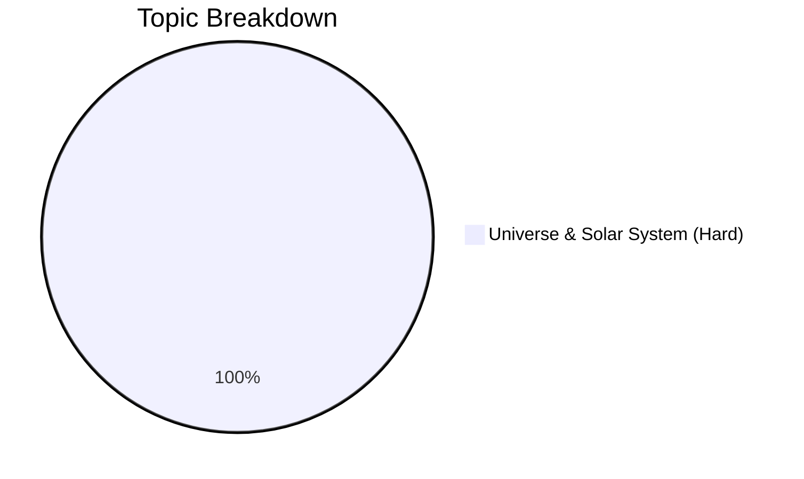

# Physical Geography

## Theory & Topics

- [[cds/geography/notes/universe|Ch 1. Universe and Solar System]]

---

## Question Taxonomy Database

- [[cds/geography/question_db|Physical Geography Question Database]]

---

## Performance Overview

---

## Navigation

- [[cds/cds_overview|CDS Exam Master Dashboard]]
