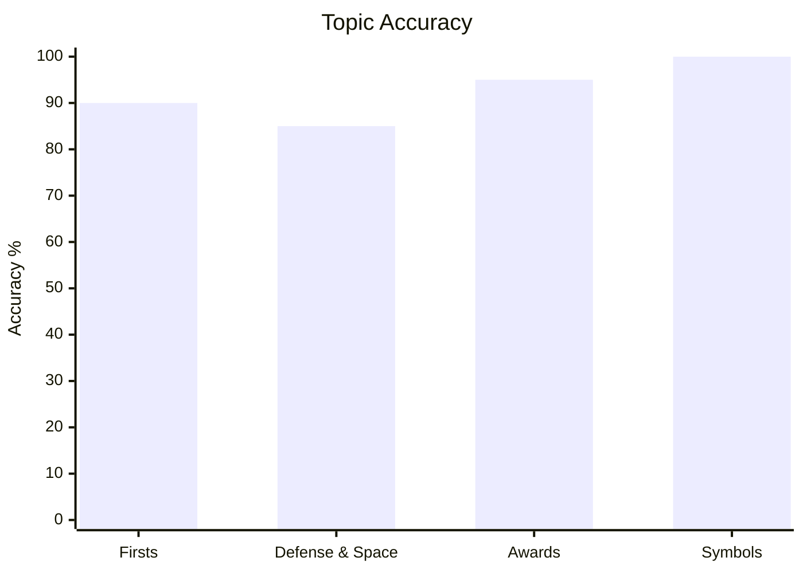
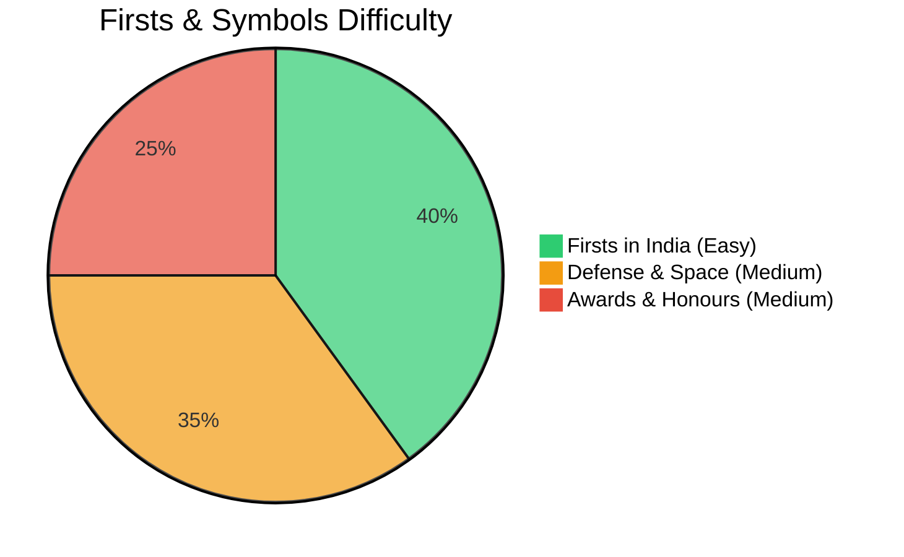
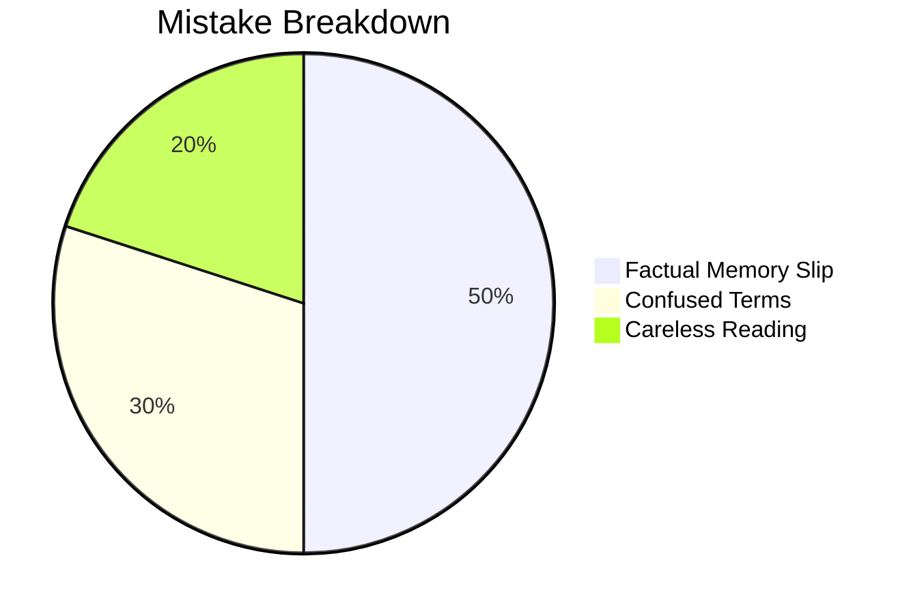

# General Knowledge

## Topics & Notes

- [[content/cds/gk/notes/gk|Indian General Knowledge Cheatsheet]]

---

## Variations

- [[content/cds/gk/notes/variations/vars#variation-1-missile-classification-traps|Variation 1: Missile Classification & Launch Platforms]]
- [[content/cds/gk/notes/variations/vars#variation-2-award-hierarchy-wartime-vs-peacetime|Variation 2: Award Hierarchy: Wartime vs. Peacetime]]
- [[content/cds/gk/notes/variations/vars#variation-3-governor-general-constitutional-transitions|Variation 3: Governor-General & Constitutional Transitions]]

---

## Performance Overview

---

## Navigation

- [[content/cds/cds_overview|CDS Master Dashboard]]
- [[content/cds/gk/question_db|Question Database]]
