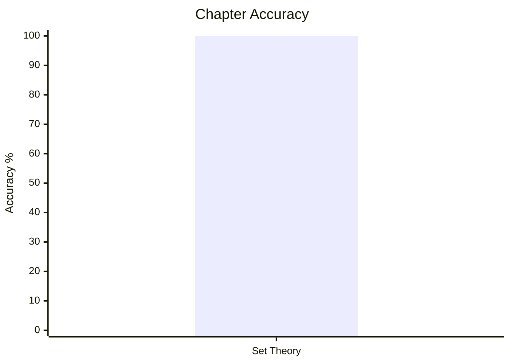
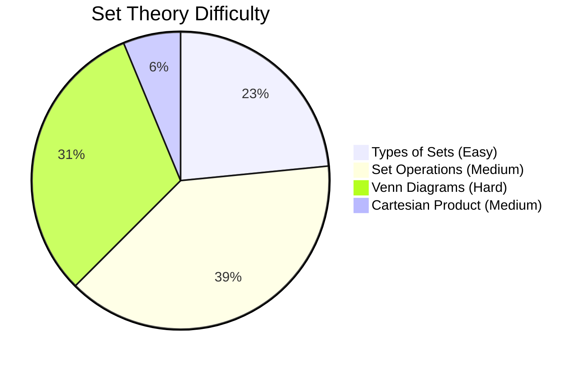

# Elementary Mathematics

## Topics & Notes

- [[content/cds/math/notes/set_theory|Set Theory]]

## Variations

- [[content/cds/math/notes/variations/vars|Set Theory Variations]]

## Performance Overview

---

## Navigation
- [[content/cds/cds_overview|CDS Dashboard]]
