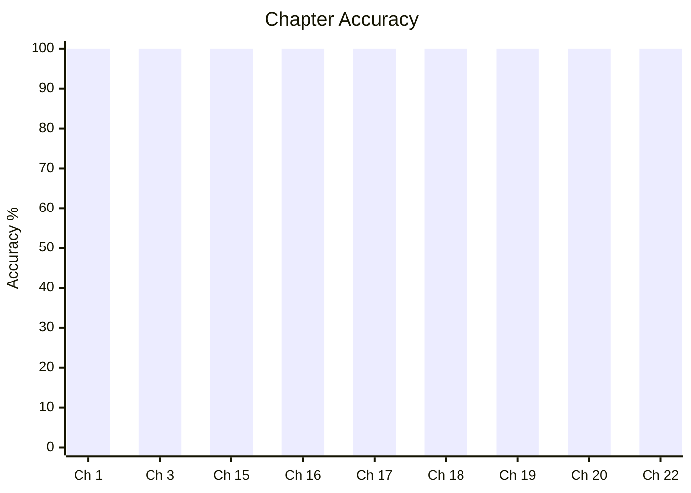
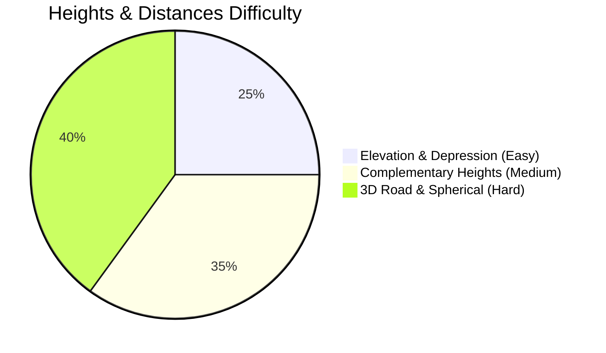

# Elementary Mathematics

## Topics & Notes

- [[content/cds/math/notes/numbers|Ch 1. Number System]]
- [[content/cds/math/notes/hcf_lcm|Ch 3. HCF and LCM of Numbers]]
- [[content/cds/math/notes/modular|Ch 3. Modular Arithmetic & Remainders]]
- [[content/cds/math/notes/polynomial_hcf_lcm|Ch 15. HCF and LCM of Polynomials]]
- [[content/cds/math/notes/rational_expressions|Ch 16. Rational Expressions]]
- [[content/cds/math/notes/linear_equations|Ch 17. Linear Equations]]
- [[content/cds/math/notes/quadratic_equations|Ch 18. Quadratic Equations & Inequalities]]
- [[content/cds/math/notes/set_theory|Ch 19. Set Theory]]
- [[content/cds/math/notes/trigonometry|Ch 20. Measurements of Angles and Trigonometric Ratios]]
- [[content/cds/math/notes/heights|Ch 21. Height and Distance]]
- [[content/cds/math/notes/heights_distances|Ch 22. Heights and Distances]]
- [[content/cds/math/notes/triangles|Ch 23. Triangles]]

## Variations

- [[content/cds/math/notes/variations/vars|Set Theory & General Variations]]
- [[content/cds/math/notes/variations/var19|Trigonometry Variations]]
- [[content/cds/math/notes/variations/var20|Generalised Multi-Point Complementary Elevation]]
- [[content/cds/math/notes/variations/var21|Elliptic Cloud Reflection in Spherical Lake]]
- [[content/cds/math/notes/variations/var22|Moving Aircraft Angular Acceleration & Speed]]
- [[content/cds/math/notes/variations/var17|Ch 23 Variations (Median, Thales, Apollonius)]]

## Performance Overview

---

## Navigation
- [[content/cds/cds_overview|CDS Dashboard]]
