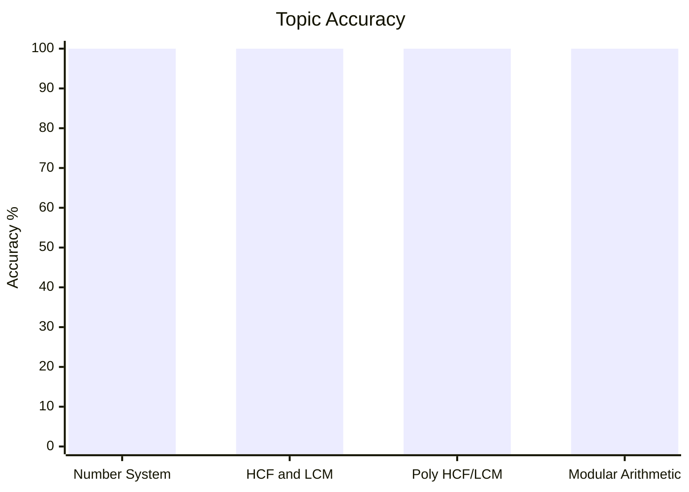
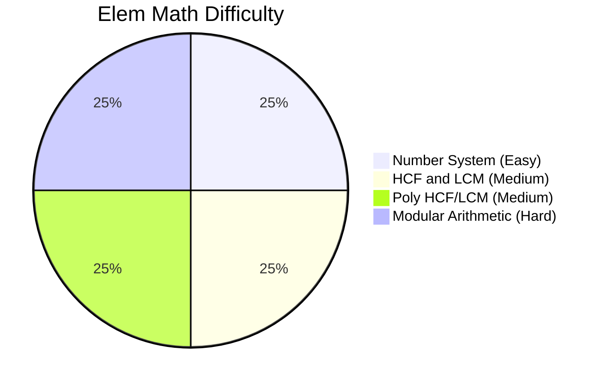
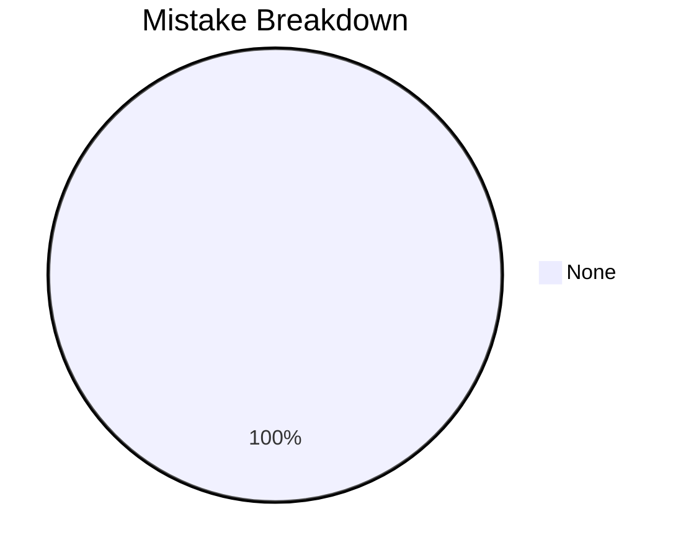

# Elementary Mathematics

## Topics & Notes

- [[cds/math/notes/formulas|Master Formulas (AP, GP, HP & Summations)]]
- [[cds/math/notes/numbers|Number System]]
- [[cds/math/notes/hcf_lcm|HCF and LCM]] ([[cds/math/notes/subtopics/hcf_lcm_cheatsheet|Key Theorems & Models Cheatsheet]])
- [[cds/math/notes/polynomial_hcf_lcm|HCF and LCM of Polynomials]]
- [[cds/math/notes/modular|Modular Arithmetic]] ([[cds/math/notes/subtopics/modular_cheatsheet|Key Theorems & Models Cheatsheet]])

## Variations

- [[cds/math/notes/variations/var1|Topic Variations (14 Solved Cases)]]

## Performance Overview

## Navigation

- [[cds/cds_overview|CDS Overview]]
- [[cds/math/question_db|Question Database]]

