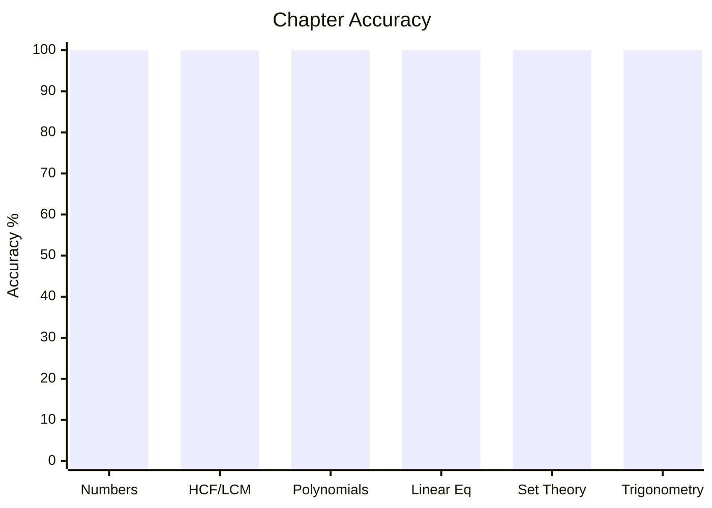
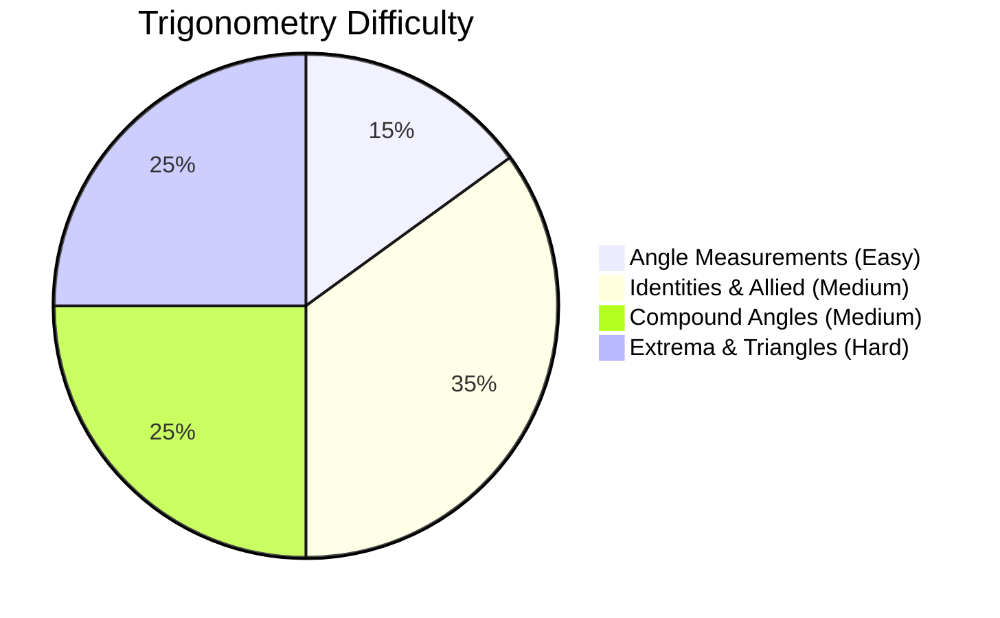

# Elementary Mathematics

## Topics & Notes

- [[content/cds/math/notes/numbers|Number System]]
- [[content/cds/math/notes/hcf_lcm|HCF and LCM of Numbers]]
- [[content/cds/math/notes/modular|Modular Arithmetic]]
- [[content/cds/math/notes/polynomial_hcf_lcm|Polynomial HCF and LCM]]
- [[content/cds/math/notes/rational_expressions|Rational Expressions]]
- [[content/cds/math/notes/linear_equations|Linear Equations]]
- [[content/cds/math/notes/set_theory|Set Theory]]
- [[content/cds/math/notes/trigonometry|Trigonometry]]

## Variations

- [[content/cds/math/notes/variations/vars|Set Theory & General Variations]]
- [[content/cds/math/notes/variations/var19|Trigonometry Variations]]

## Performance Overview

---

## Navigation
- [[content/cds/cds_overview|CDS Dashboard]]
