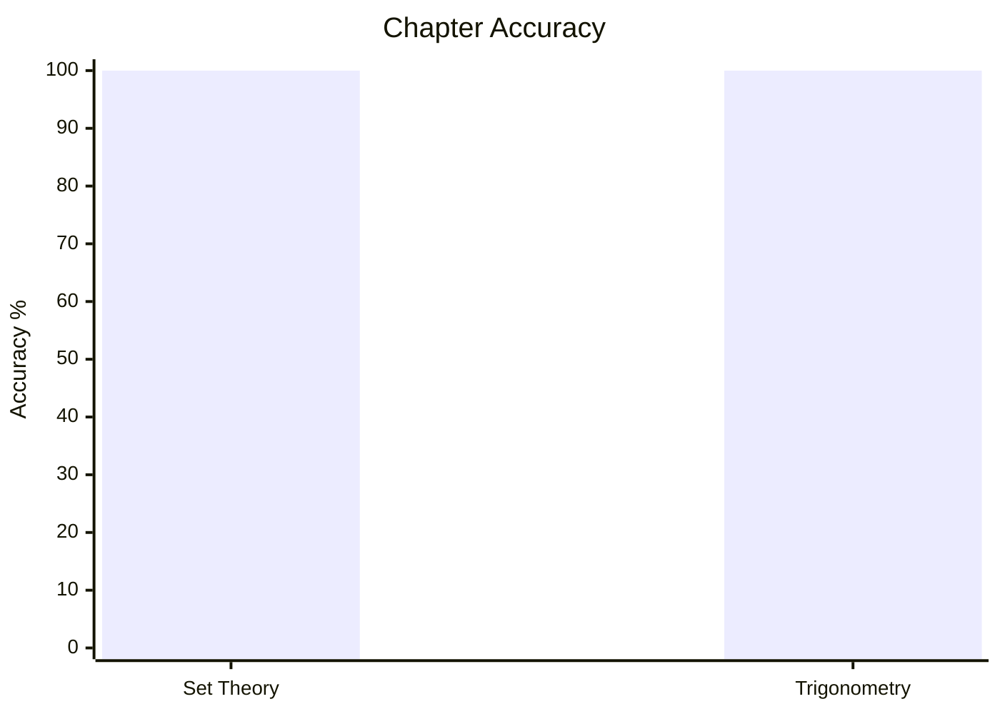
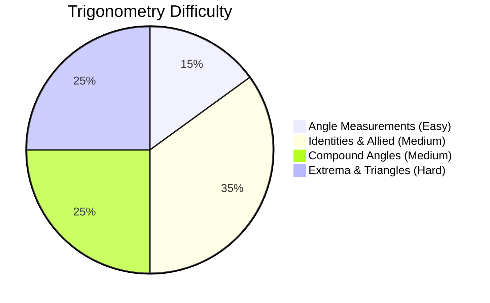

# Elementary Mathematics

## Topics & Notes

- [[content/cds/math/notes/set_theory|Set Theory]]
- [[content/cds/math/notes/trigonometry|Trigonometry]]

## Variations

- [[content/cds/math/notes/variations/vars|Set Theory Variations]]
- [[content/cds/math/notes/variations/var19|Trigonometry Variations]]

## Performance Overview

---

## Navigation
- [[content/cds/cds_overview|CDS Dashboard]]
