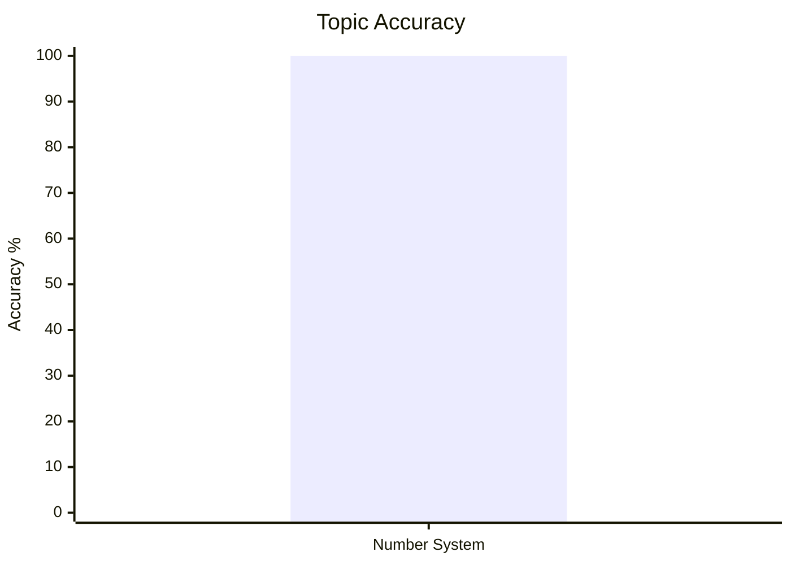
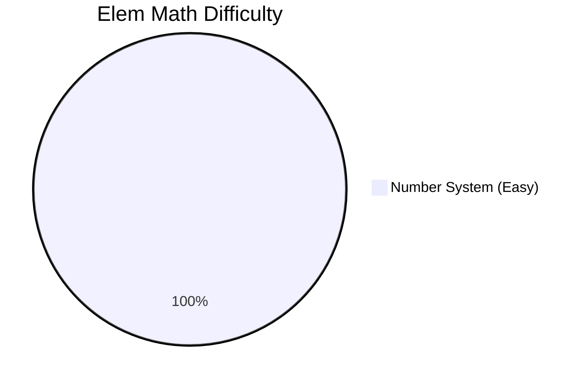
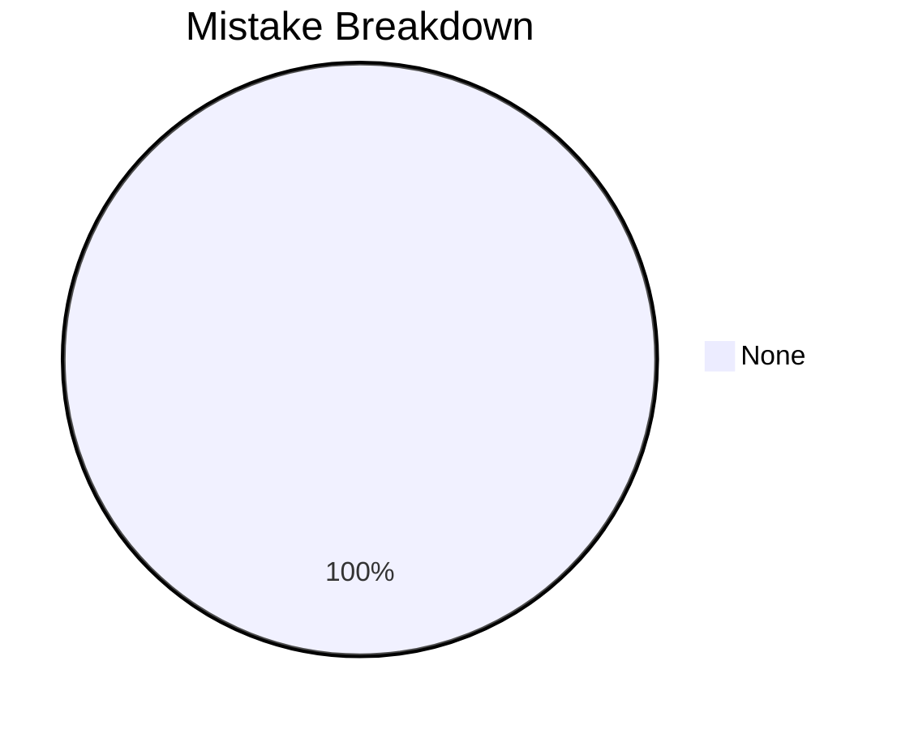

# Elementary Mathematics

## Topics & Notes

- [[cds/math/notes/numbers|Number System]]

## Variations

- [[cds/math/notes/variations/vars|Number System Variations]]

## Performance Overview

## Navigation

- [[cds/cds_overview|CDS Overview]]
- [[cds/math/question_db|Question Database]]
