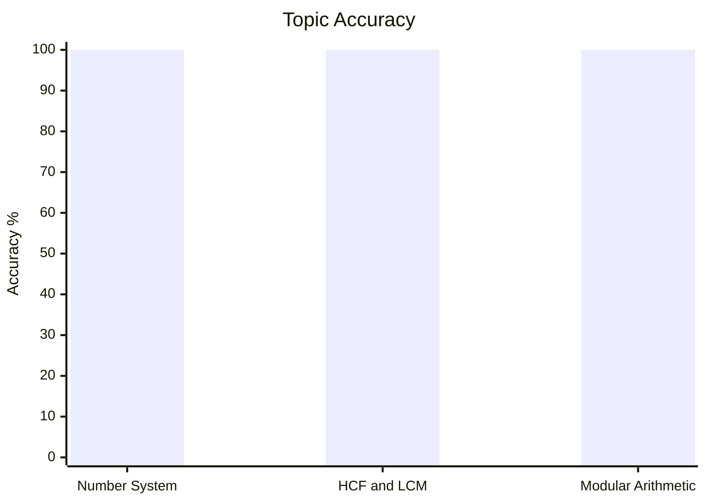
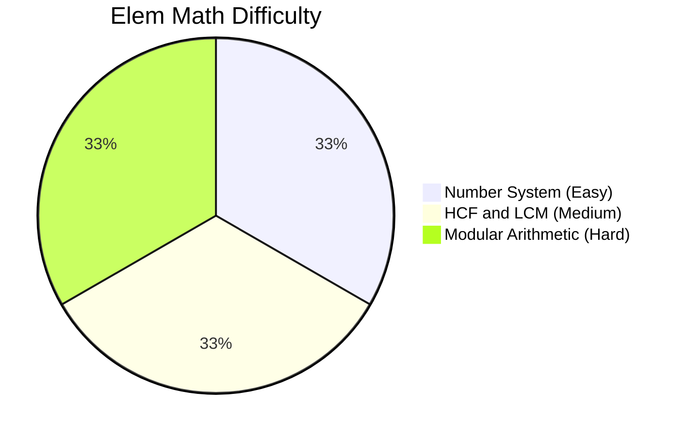
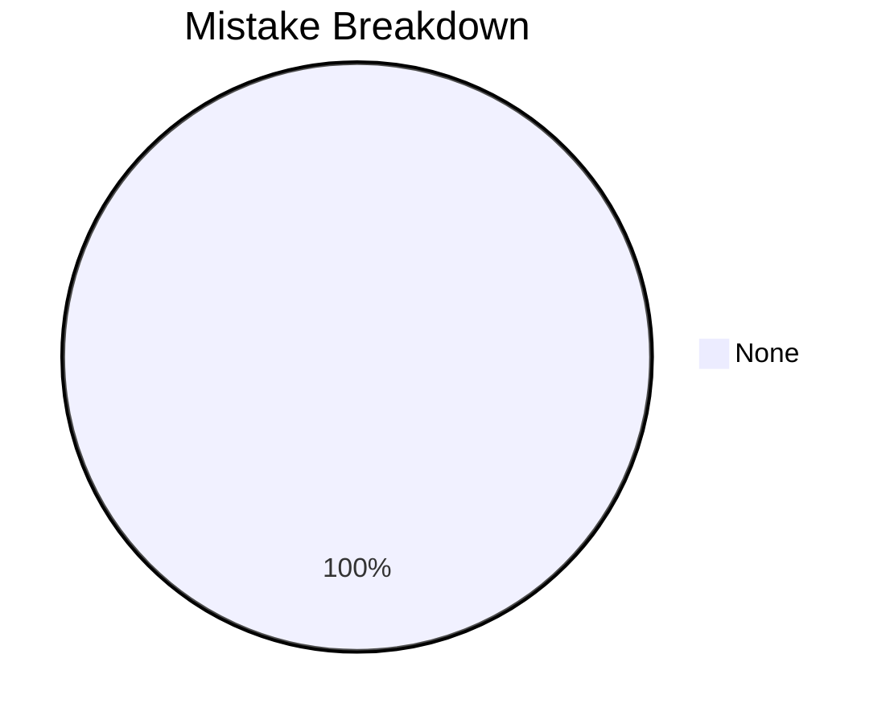

# Elementary Mathematics

## Topics & Notes

- [[cds/math/notes/formulas|Master Formulas (AP, GP, HP & Summations)]]
- [[cds/math/notes/numbers|Number System]]
- [[cds/math/notes/hcf_lcm|HCF and LCM]]
- [[cds/math/notes/modular|Modular Arithmetic]]

## Variations

- [[cds/math/notes/variations/vars|Number System, HCF & LCM Variations]]

## Performance Overview

## Navigation

- [[cds/cds_overview|CDS Overview]]
- [[cds/math/question_db|Question Database]]

