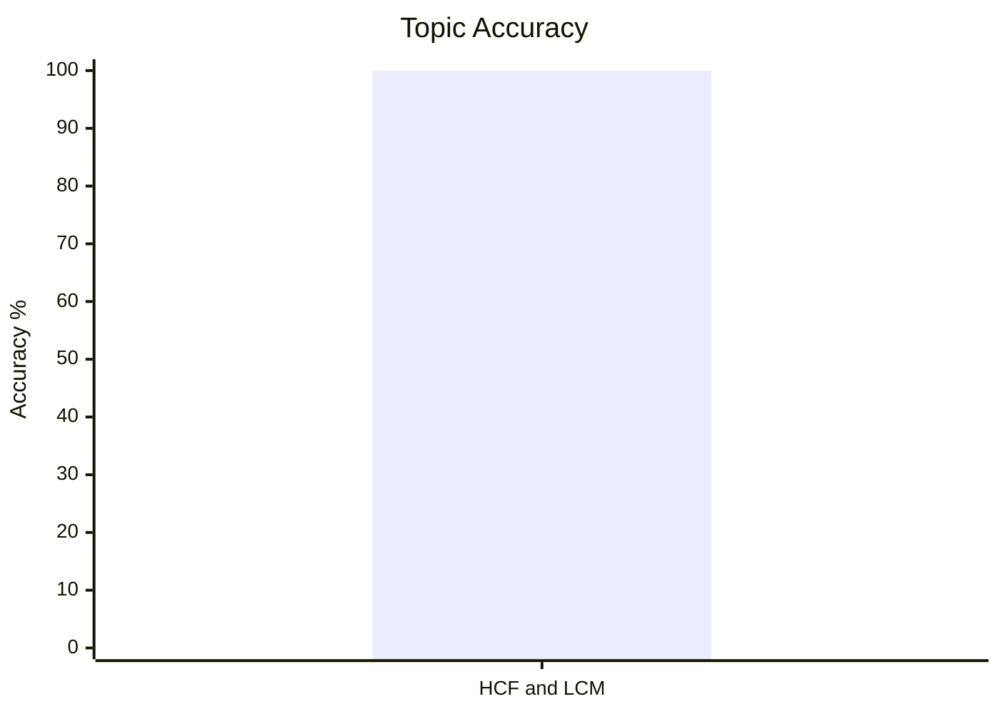
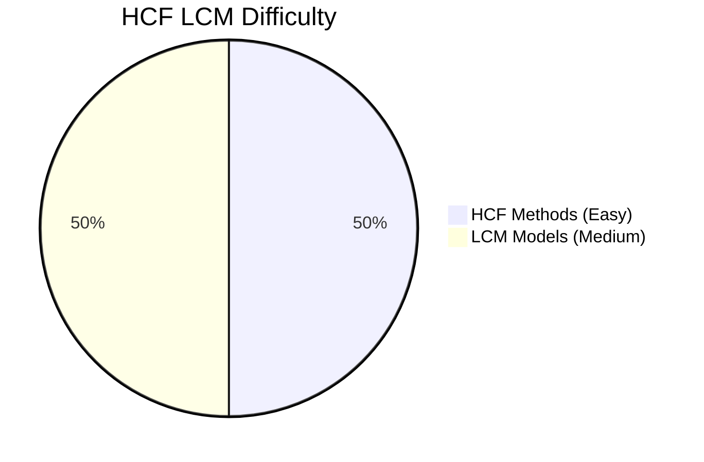
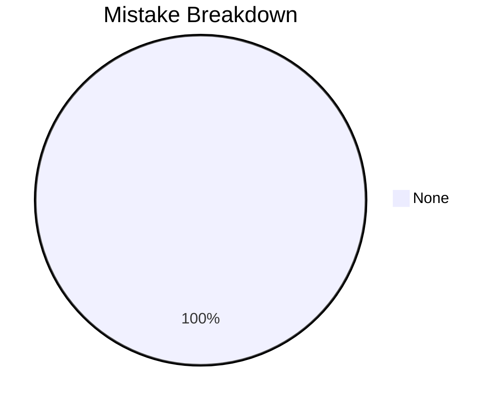

# HCF and LCM

## Theory, Intuition & Formulas

### 1. Fundamental Definitions & Canonical Prime Factorization
- **Highest Common Factor (HCF / GCD)**: The greatest positive integer that divides each of the given numbers without leaving a remainder.
  - For canonical factorizations $A = p_1^{a_1} p_2^{a_2} \cdots p_k^{a_k}$ and $B = p_1^{b_1} p_2^{b_2} \cdots p_k^{b_k}$:
    $$\operatorname{HCF}(A, B) = p_1^{\min(a_1, b_1)} \cdot p_2^{\min(a_2, b_2)} \cdots p_k^{\min(a_k, b_k)}$$
- **Least Common Multiple (LCM)**: The smallest positive integer that is divisible by each of the given numbers.
  - For canonical factorizations:
    $$\operatorname{LCM}(A, B) = p_1^{\max(a_1, b_1)} \cdot p_2^{\max(a_2, b_2)} \cdots p_k^{\max(a_k, b_k)}$$

### 2. Fundamental Product Identity
For any two positive integers $A$ and $B$:
$$\operatorname{HCF}(A, B) \times \operatorname{LCM}(A, B) = A \times B$$
> [!WARNING]
> This product identity holds **strictly for two numbers only**! For three or more numbers, $\operatorname{HCF}(A, B, C) \times \operatorname{LCM}(A, B, C) \neq A \cdot B \cdot C$.

Of course! From prime factorization it is clear. One is choosing the max and the other the min powers. When we have three or more terms the middle powers may be left.
### 3. Co-prime Representation Model
If $\operatorname{HCF}(A, B) = H$, then the numbers can always be written as:
$$A = H \cdot x, \quad B = H \cdot y \quad \text{where } \operatorname{GCD}(x, y) = 1 \text{ (co-prime)}$$
- Product relation: $A \cdot B = H^2 x y = H \cdot L \implies \operatorname{LCM}(A, B) = L = H \cdot x \cdot y$.
- Ratio of numbers: $\frac{A}{B} = \frac{x}{y}$ (in lowest reduced form).
A method of finding HCF of two numbers!
Reduce them to lowest form. Then divied by correpoding term, you have got H then find L.
### 4. Fractions & Polynomials HCF & LCM

#### A. Fraction HCF & LCM Formulas
$$\operatorname{HCF}\left(\frac{a}{b}, \frac{c}{d}, \frac{e}{f}\right) = \frac{\operatorname{HCF}(a, c, e)}{\operatorname{LCM}(b, d, f)}$$

$$\operatorname{LCM}\left(\frac{a}{b}, \frac{c}{d}, \frac{e}{f}\right) = \frac{\operatorname{LCM}(a, c, e)}{\operatorname{HCF}(b, d, f)}$$

*(Note: All fractions MUST be in lowest reduced form before applying these formulas!)*

---

#### 💡 The Intuition & Rigorous Proof

Let's understand **WHY** the numerator takes HCF/LCM while the denominator takes the opposite (LCM/HCF):

##### 1. Intuition for $\operatorname{HCF}\left(\frac{a}{b}, \frac{c}{d}\right)$:
- By definition, the HCF fraction $X = \frac{x}{y}$ must **divide** both $\frac{a}{b}$ and $\frac{c}{d}$ to produce **INTEGER quotients**.
- Look at the division:
  $$\frac{a/b}{x/y} = \frac{a \cdot y}{b \cdot x} = \text{INTEGER}$$
- For $\frac{a \cdot y}{b \cdot x}$ to be a whole integer:
  1. $x$ (the numerator of the factor) **must divide $a$** $\implies x$ must be a common factor of numerators ($a, c, e$). To make $X$ as **large as possible**, $x$ must be the **$\operatorname{HCF}(a, c, e)$**.
  2. $y$ (the denominator of the factor) **must be divisible by $b$** $\implies y$ must be a common multiple of denominators ($b, d, f$). To make the fraction $X = \frac{x}{y}$ as **large as possible**, the denominator $y$ must be as **small as possible**, so $y$ must be the **$\operatorname{LCM}(b, d, f)$**.

##### 2. Intuition for $\operatorname{LCM}\left(\frac{a}{b}, \frac{c}{d}\right)$:
- By definition, the LCM fraction $Y = \frac{u}{v}$ must be **divisible** by both $\frac{a}{b}$ and $\frac{c}{d}$ to produce **INTEGER quotients**.
- Look at the division:
  $$\frac{u/v}{a/b} = \frac{u \cdot b}{v \cdot a} = \text{INTEGER}$$
- For $\frac{u \cdot b}{v \cdot a}$ to be a whole integer:
  1. $u$ **must be divisible by $a$** $\implies u$ must be a common multiple of numerators ($a, c, e$). To make $Y$ as **small as possible**, $u$ must be the **$\operatorname{LCM}(a, c, e)$**.
  2. $v$ **must divide $b$** $\implies v$ must be a common factor of denominators ($b, d, f$). To make $Y = \frac{u}{v}$ as **small as possible**, the denominator $v$ must be as **large as possible**, so $v$ must be the **$\operatorname{HCF}(b, d, f)$**.

---

#### ✍️ Concrete Numerical Example

Find the HCF and LCM of $\frac{2}{3}, \frac{8}{9}, \frac{16}{81}$:

1. **Calculate HCF:**
   - Numerators HCF: $\operatorname{HCF}(2, 8, 16) = \mathbf{2}$
   - Denominators LCM: $\operatorname{LCM}(3, 9, 81) = \mathbf{81}$
   $$\text{HCF} = \mathbf{\frac{2}{81}}$$

2. **Calculate LCM:**
   - Numerators LCM: $\operatorname{LCM}(2, 8, 16) = \mathbf{16}$
   - Denominators HCF: $\operatorname{HCF}(3, 9, 81) = \mathbf{3}$
   $$\text{LCM} = \mathbf{\frac{16}{3}}$$

- **Polynomials**:
  - Express polynomials in fully factored product form over $\mathbb{R}$ or $\mathbb{Z}$.
  - Take lowest powers of common irreducible linear/quadratic factors for HCF, and highest powers of all factors for LCM.

---

## Subtopics & Core Models

- [[cds/math/notes/subtopics/hcf_methods|HCF Models & Co-Prime Copair Counting]]
- [[cds/math/notes/subtopics/lcm_models|LCM Models & Remainder Theorems]]

---

## Variations

- [[cds/math/notes/variations/var8|HCF via Successive Quotients]]
- [[cds/math/notes/variations/var9|Co-prime Pairs Given Product & HCF]]
- [[cds/math/notes/variations/var10|Largest 4-Digit Number with Constant Remainder]]
- [[cds/math/notes/variations/var11|Smallest 4-Digit Number with Constant Difference]]

---

## Performance Overview

---

## Navigation

- [[cds/math/math_overview|Elementary Mathematics Overview]]
- [[cds/math/question_db|Question Database]]
