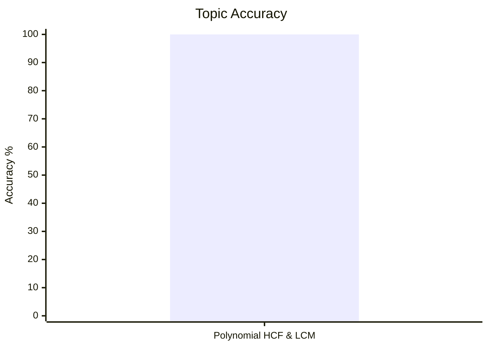
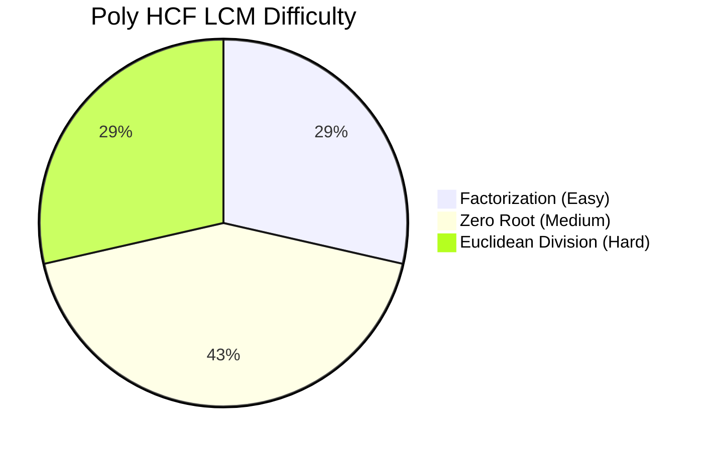
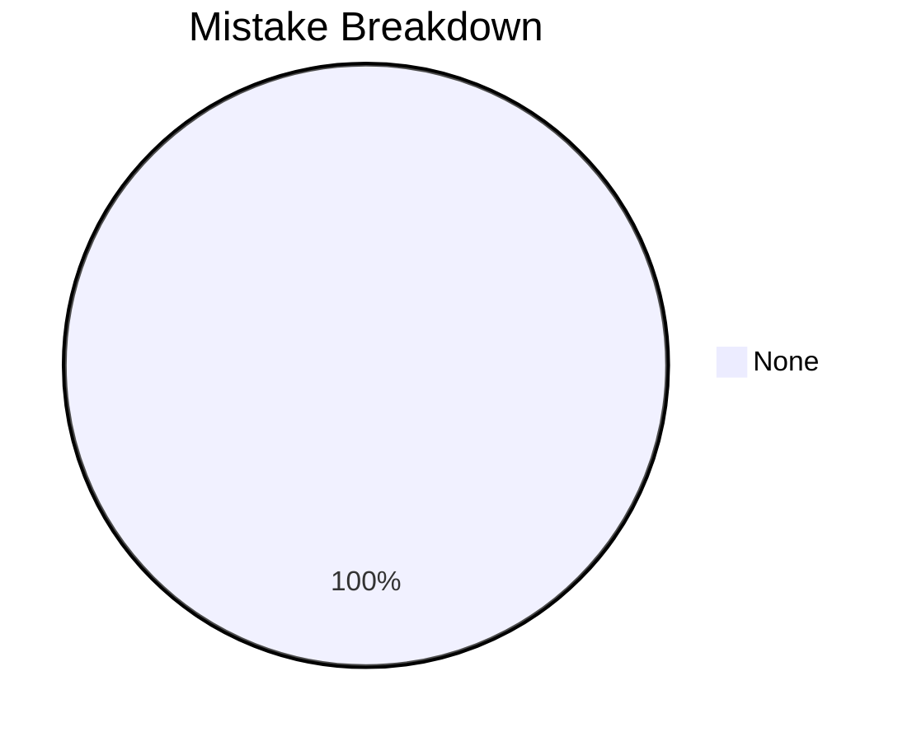

# HCF and LCM of Polynomials

## Theory, Intuition & Formulas

### 1. Fundamental Definition & Multiplicity
- **HCF (Greatest Common Divisor)** of polynomials $P(x)$ and $Q(x)$: The monic polynomial $H(x)$ of highest degree that divides both $P(x)$ and $Q(x)$ without remainder.
- **LCM (Least Common Multiple)** of polynomials $P(x)$ and $Q(x)$: The monic polynomial $L(x)$ of lowest degree that is divisible by both $P(x)$ and $Q(x)$ without remainder.

### 2. Fundamental Polynomial Product Identity
For any two polynomials $P(x)$ and $Q(x)$:
$$P(x) \cdot Q(x) = \text{c} \cdot \operatorname{HCF}(P(x), Q(x)) \times \operatorname{LCM}(P(x), Q(x))$$
*(where $c$ is a numerical scalar multiplier reflecting leading coefficients).*

---

## Core Methods & Subtopic Index

1. [[cds/math/notes/subtopics/poly_factorization|Polynomial Factorization HCF & LCM]]
   - Factoring via algebraic identities ($a^3 \pm b^3$, $a^4 - b^4$, Sophie Germain).
   - Numerical coefficient HCF/LCM separation.

2. [[cds/math/notes/subtopics/poly_euclidean_division|Euclidean Division Algorithm for Polynomials]]
   - Successive polynomial division $P(x) = Q(x) q_1(x) + R_1(x)$.
   - Scalar factor removal from intermediate remainders.

3. [[cds/math/notes/subtopics/poly_zero_root|Zero Root Evaluation Method]]
   - Factor Theorem: $(x - k) \mid P(x) \iff P(k) = 0$.
   - Linear HCF parameter formula: $k = \frac{b-q}{a-p}$ for $x^2+ax+b$ and $x^2+px+q$.
   - Simultaneous parameter systems ($P(x) \pm Q(x)$ sum and difference recovery).

---

## Linked Practice Questions

- [[cds/math/notes/questions/q29|Q29: Factorable Polynomial LCM]]
- [[cds/math/notes/questions/q30|Q30: Multi-Polynomial Numerical & Variable HCF]]
- [[cds/math/notes/questions/q31|Q31: Euclidean Long Division for High-Degree Polynomials]]
- [[cds/math/notes/questions/q32|Q32: Linear HCF Parameter Evaluation Formula]]
- [[cds/math/notes/questions/q33|Q33: Simultaneous Dual Quadratic HCF Parameters]]
- [[cds/math/notes/questions/q34|Q34: Polynomial Recovery from Sum & Difference]]
- [[cds/math/notes/questions/q35|Q35: Polynomial Recovery from HCF and LCM]]

---

## Variations

- [[cds/math/notes/variations/var12|Variation 12: Dual Parameter Polynomial HCF]]
- [[cds/math/notes/variations/var13|Variation 13: Higher Power Sophie Germain Identity HCF]]
- [[cds/math/notes/variations/var14|Variation 14: Difference of Powers Divisibility Identity]]

---

## Performance Overview

---

## Navigation

- [[cds/math/math_overview|Elementary Mathematics Overview]]
- [[cds/math/question_db|Question Database]]
