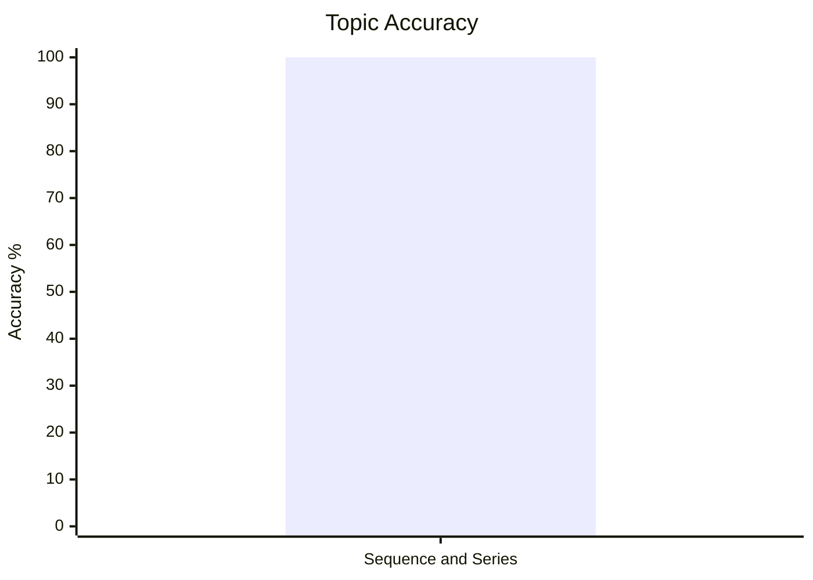
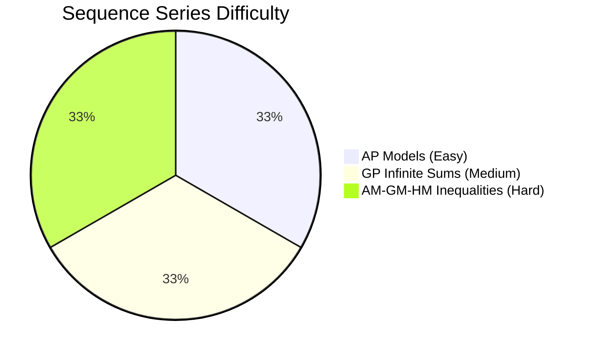
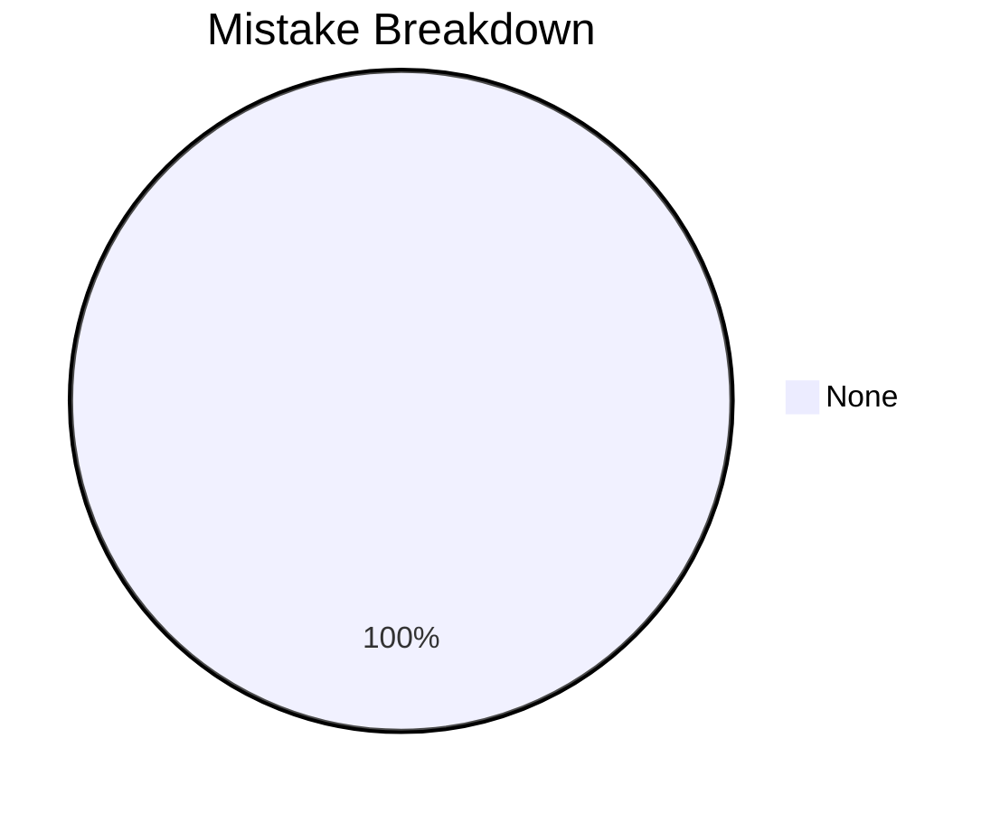

# Sequence and Series

## Theory, Intuition & Formulas

### 1. Fundamentals of Sequences, Series and Progressions
- **Sequence**: An ordered set of numbers $a_1, a_2, a_3, \dots, a_n$ defined according to a specific deterministic rule.
- **Series**: The sum of terms of a sequence, expressed as $S_n = a_1 + a_2 + a_3 + \dots + a_n$.
- **Progression**: A sequence whose terms follow uniform arithmetic, geometric, or harmonic patterns.

### 2. Arithmetic Progression (AP)
A sequence where the difference between any term and its preceding term is constant ($d = a_{k} - a_{k-1}$).
- **General Form**: $a, a+d, a+2d, \dots, a+(n-1)d$.
- **General $n$-th Term ($T_n$)**:
  $$T_n = a + (n-1)d$$
- **Sum of First $n$ Terms ($S_n$)**:
  $$S_n = \frac{n}{2} [2a + (n-1)d] = \frac{n}{2} [a + l]$$
  where $l = T_n$ is the last term.
- **Arithmetic Mean (AM)**:
  If $a, M, b$ are in AP, then $M$ is the Arithmetic Mean:
  $$M = \frac{a + b}{2}$$

### 3. Geometric Progression (GP)
A sequence of non-zero terms where each term is obtained by multiplying the preceding term by a constant ratio $r = \frac{a_k}{a_{k-1}}$.
- **General Form**: $a, ar, ar^2, \dots, ar^{n-1}$.
- **General $n$-th Term ($T_n$)**:
  $$T_n = a \cdot r^{n-1}$$
- **Sum of First $n$ Terms ($S_n$)**:
  $$S_n = \frac{a(r^n - 1)}{r - 1} \quad (r > 1) \qquad \text{or} \qquad S_n = \frac{a(1 - r^n)}{1 - r} \quad (r < 1)$$
- **Sum of Infinite Geometric Series ($S_\infty$)**:
  For $|r| < 1$:
  $$S_\infty = \frac{a}{1 - r}$$
- **Geometric Mean (GM)**:
  If $a, G, b$ are positive numbers in GP, then $G$ is the Geometric Mean:
  $$G = \sqrt{a b}$$

### 4. Harmonic Progression (HP)
A sequence $a_1, a_2, \dots, a_n$ is in HP if their reciprocals $\frac{1}{a_1}, \frac{1}{a_2}, \dots, \frac{1}{a_n}$ form an Arithmetic Progression.
- **General $n$-th Term ($T_n$)**:
  $$T_n = \frac{1}{\frac{1}{a} + (n-1)D}$$
- **Harmonic Mean (HM)**:
  If $a, H, b$ are positive numbers in HP, then $H$ is the Harmonic Mean:
  $$H = \frac{2ab}{a + b}$$

### 5. Special Series Sums & Memory Hacks
1. **Sum of First $n$ Natural Numbers**:
   $$\sum n = 1 + 2 + 3 + \dots + n = \frac{n(n+1)}{2}$$
2. **Sum of Squares of First $n$ Natural Numbers**:
   $$\sum n^2 = 1^2 + 2^2 + 3^2 + \dots + n^2 = \frac{n(n+1)(2n+1)}{6}$$
   > [!TIP] Memory Hook for $\sum n^2$
   > - First two factors: $n(n+1)$ (same as natural sum numerator)
   > - Third factor: Sum of first two factors $\rightarrow n + (n+1) = \mathbf{2n+1}$
   > - Denominator: **6** (degree is 3, $1 \times 2 \times 3 = 6$)
3. **Sum of Cubes of First $n$ Natural Numbers**:
   $$\sum n^3 = 1^3 + 2^3 + 3^3 + \dots + n^3 = \left[ \frac{n(n+1)}{2} \right]^2 = (\sum n)^2$$
   > [!TIP] Memory Hook for $\sum n^3$
   > Simply **square** the sum of natural numbers: $\sum n^3 = (\sum n)^2$.

### 6. Derived Speed Results & Key Properties
- **Sum of first $n$ ODD Natural Numbers**: $1 + 3 + 5 + \dots + (2n-1) = \mathbf{n^2}$
- **Sum of first $n$ EVEN Natural Numbers**: $2 + 4 + 6 + \dots + 2n = \mathbf{n(n+1)}$
- **Sum of Squares of EVEN Numbers**: $2^2 + 4^2 + 6^2 + \dots + (2n)^2 = \mathbf{\frac{2n(n+1)(2n+1)}{3}}$
- **Sum of Squares of ODD Numbers**: $1^2 + 3^2 + 5^2 + \dots + (2n-1)^2 = \mathbf{\frac{n(2n-1)(2n+1)}{3}}$
- **Product of Consecutive Integers**: $1 \cdot 2 + 2 \cdot 3 + \dots + n(n+1) = \mathbf{\frac{n(n+1)(n+2)}{3}}$
- **Alternate Signs Squares ($n$ is even)**: $1^2 - 2^2 + 3^2 - 4^2 + \dots - n^2 = \mathbf{-\frac{n(n+1)}{2}}$

### 7. Inequalities & Fundamental Relation Between Means
For any two positive real numbers $a$ and $b$:
1. **Fundamental Inequality**:
   $$A \ge G \ge H$$
   where equality $A = G = H$ holds if and only if $a = b$.
2. **Geometric Mean Square Identity**:
   $$G^2 = A \times H$$
   *(The Geometric Mean $G$ is the Geometric Mean between $A$ and $H$!)*

---

## Subtopics & Core Models

- [[cds/math/notes/subtopics/ap_properties|AP General Terms, Sums & Arithmetic Means]]
- [[cds/math/notes/subtopics/gp_properties|GP Infinite Sums & Geometric Means]]
- [[cds/math/notes/subtopics/hp_am_gm_hm|HP Properties & AM-GM-HM Fundamental Inequalities]]

---

## Variations

- [[cds/math/notes/variations/vars|Ch 2 Sequence and Series Variations]]

---

## Performance Overview

---

## Navigation

- [[cds/math/math_overview|Elementary Mathematics Overview]]
- [[cds/math/question_db|Question Database]]
