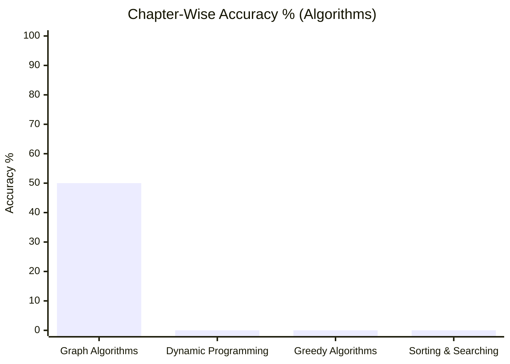
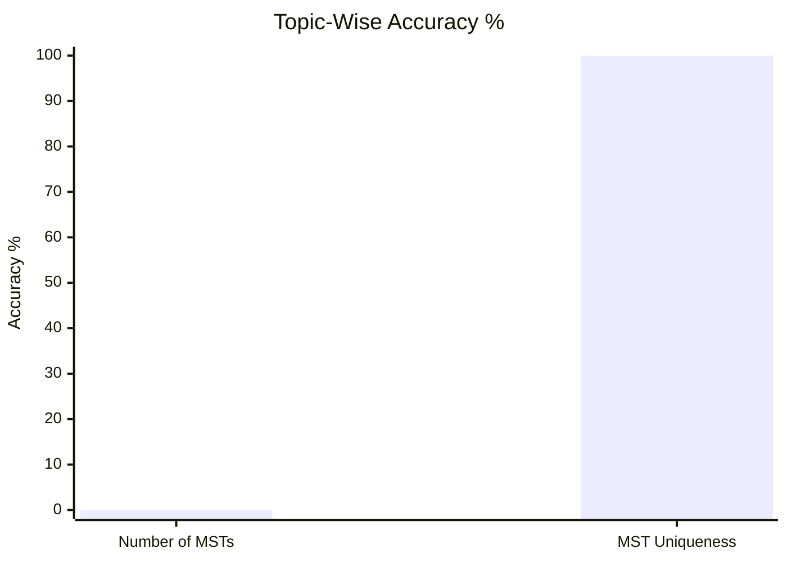

# Algorithms

## Topics & Notes

### Graph Algorithms
#### Minimum Spanning Trees (MST)
- [[content/gate-cs/algorithms/notes/counting_msts_formulaic|Counting MSTs]]
- [[content/gate-cs/algorithms/notes/mst_uniqueness_theorem|MST Uniqueness]]

#### Shortest Paths
- *No notes yet.*

---

## Chapter Variations
- [[content/gate-cs/algorithms/notes/variations/mst_shortest_path_equivalence|MST vs Shortest Path Tree Equivalence]]
- [[content/gate-cs/algorithms/notes/variations/kruskal_dsu_complexity|Kruskal DSU Complexity]]
- [[content/gate-cs/algorithms/notes/variations/counting_msts_variations|Counting MSTs Theorems]]

---

## Performance Overview

### 1. Chapter-Wise Accuracy %

### 2. Topic-Wise Accuracy %

---

## Navigation
- [[content/gate-cs/algorithms/question_db|Question Database]]
- [[content/exams_config|All Exams & Subjects]]
