# Algorithms

## Subject Overview & Visual Analytics

### Accuracy & Mastery Heatmap

```mermaid
gantt
    title Topic Accuracy % Heatmap
    dateFormat X
    axisFormat %s%%
    section Graph Algorithms
    Number of MSTs : crit, 0, 0
    MST Uniqueness : active, 0, 100
```

---

## Topics & Notes

### Graph Algorithms
#### Minimum Spanning Trees (MST)
- [[content/gate-cs/algorithms/notes/counting_msts_formulaic|Counting MSTs]]
- [[content/gate-cs/algorithms/notes/mst_uniqueness_theorem|MST Uniqueness]]

#### Shortest Paths
- *No notes yet.*

---

## Chapter Variations
- [[content/gate-cs/algorithms/notes/variations/mst_shortest_path_equivalence|MST vs Shortest Path Tree Equivalence]]
- [[content/gate-cs/algorithms/notes/variations/kruskal_dsu_complexity|Kruskal DSU Complexity]]
- [[content/gate-cs/algorithms/notes/variations/counting_msts_variations|Counting MSTs Theorems]]

---

## Navigation
- [[content/gate-cs/algorithms/question_db|Question Database]]
- [[content/exams_config|All Exams & Subjects]]
