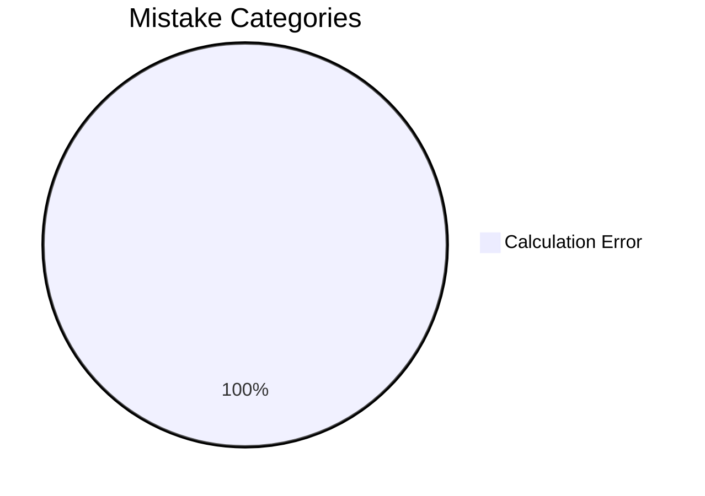
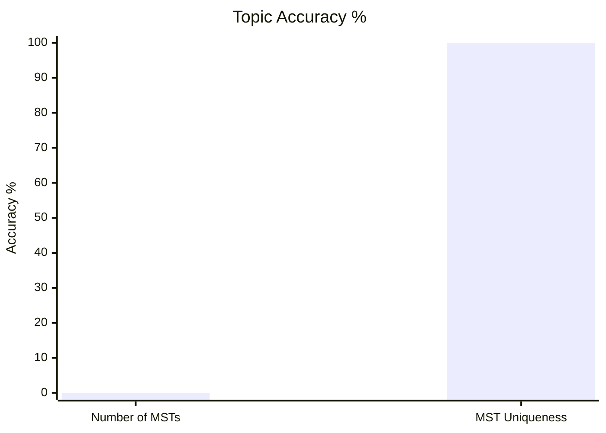

# Question Database

## Performance Overview

### Mistake Distribution


### Topic Accuracy %


---


## Dynamic Obsidian Dataview Query

```dataview
TABLE 
    rows.question_type AS "Question Types / Specializations",
    rows.file.link AS "Logged Question Notes"
FROM "content/gate-cs/algorithms/notes"
GROUP BY topic + " > " + subtopic AS "Topic & Subtopic"
```

