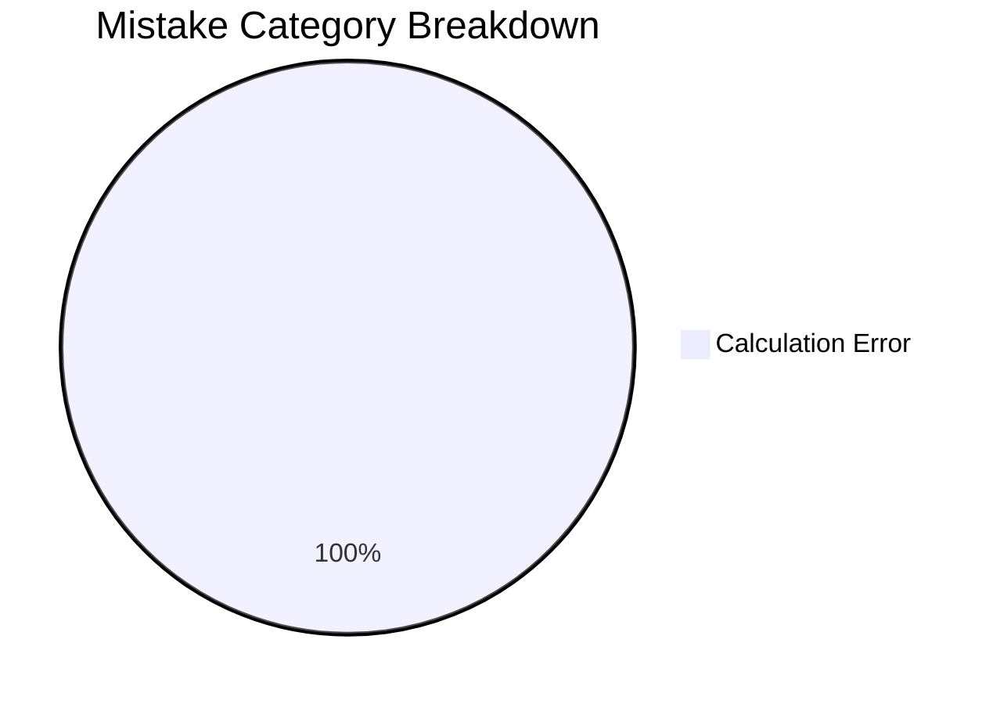

# Question Database — Algorithms

## Performance & Analytics Overview

### 1. Mistake Distribution Chart


### 2. Topic Accuracy Heatmap

```mermaid
gantt
    title Topic Accuracy %
    dateFormat X
    axisFormat %s%%
    section Algorithms
    Number of MSTs : crit, 0, 0
    MST Uniqueness : active, 0, 100
```


---

## Topic & Question Taxonomy Database

| Topic | Subtopic | Question Type / Specialization | Logged Questions & Notes | Performance | Logged Mistake Types |
| :--- | :--- | :--- | :--- | :---: | :--- |
| **Minimum Spanning Trees** | Number of MSTs | Formulaic Edge Conditions ($w(e) = i+j$) | • [[content/gate-cs/algorithms/notes/questions/gate_2021_q34_counting_msts\|GATE '21 Q34 (❌)]] | 0 / 1 (0%) | 1x Calculation Error |
| | Uniqueness | Distinct Edge Weights Theorem | • [[content/gate-cs/algorithms/notes/questions/gate_2018_q12_mst\|GATE '18 Q12 (✅)]] | 1 / 1 (100%) | None |

---

## Dynamic Obsidian Dataview Query

```dataview
TABLE 
    rows.question_type AS "Question Types / Specializations",
    rows.file.link AS "Logged Question Notes"
FROM "content/gate-cs/algorithms/notes"
GROUP BY topic + " > " + subtopic AS "Topic & Subtopic"
```

