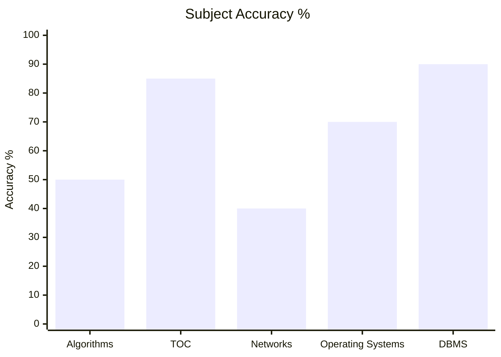
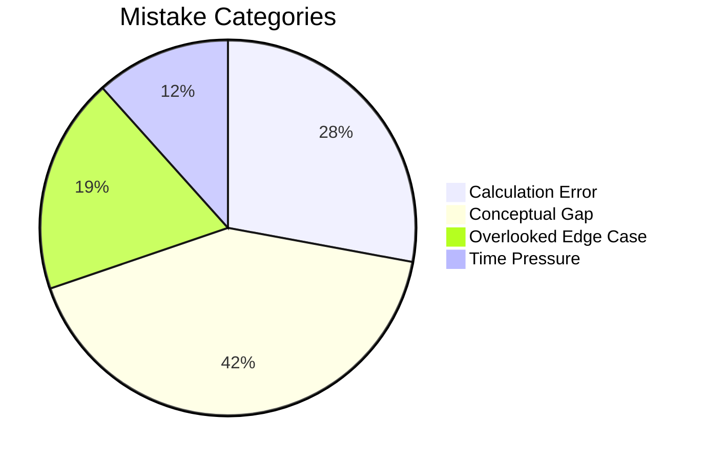

# GATE CS

## Subjects
- [[content/gate-cs/algorithms/algorithms_overview|Algorithms Overview]]
- [[content/gate-cs/theory-of-computation/toc_overview|Theory of Computation]]
- [[content/gate-cs/computer-networks/networks_overview|Computer Networks]]
- [[content/gate-cs/operating-systems/os_overview|Operating Systems]]
- [[content/gate-cs/dbms/dbms_overview|DBMS]]

---

## Performance Overview

### Subject Accuracy %

### Mistake Categories

---

## Navigation
- [[content/exams_config|Exams Config]]
