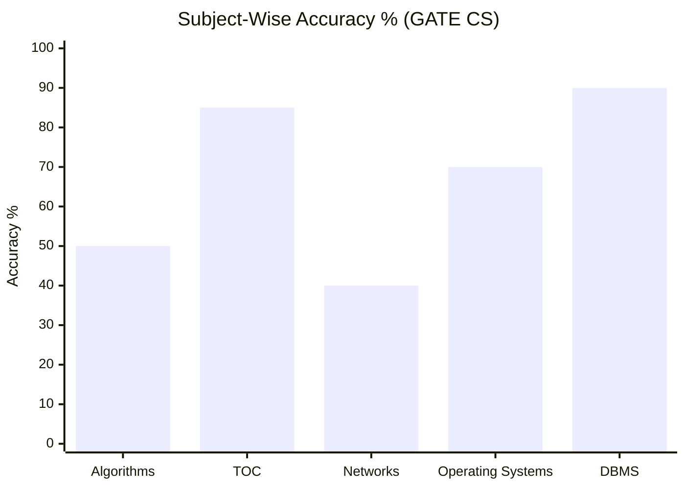
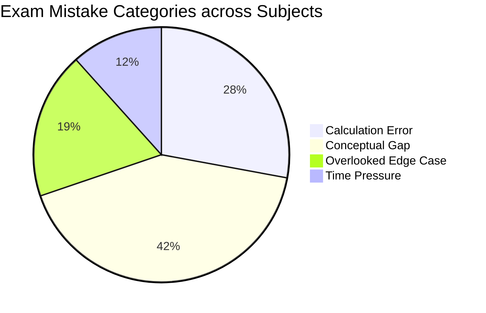

# GATE CS — Exam Master Dashboard

## Exam-Level Performance Overview

### 1. Subject-Wise Accuracy % (Exam Level)

### 2. Subject Mistake Breakdown

---

## Active Subjects & Index Hubs
- [[content/gate-cs/algorithms/index|Algorithms]] *(1/2 Accuracy | 50%)*
- [[content/gate-cs/theory-of-computation/index|Theory of Computation]] *(No sessions logged yet)*
- [[content/gate-cs/computer-networks/index|Computer Networks]] *(No sessions logged yet)*
- [[content/gate-cs/operating-systems/index|Operating Systems]] *(No sessions logged yet)*
- [[content/gate-cs/dbms/index|DBMS]] *(No sessions logged yet)*

---

## Exam Navigation
- [[content/exams_config|Master Exams Registry]]
