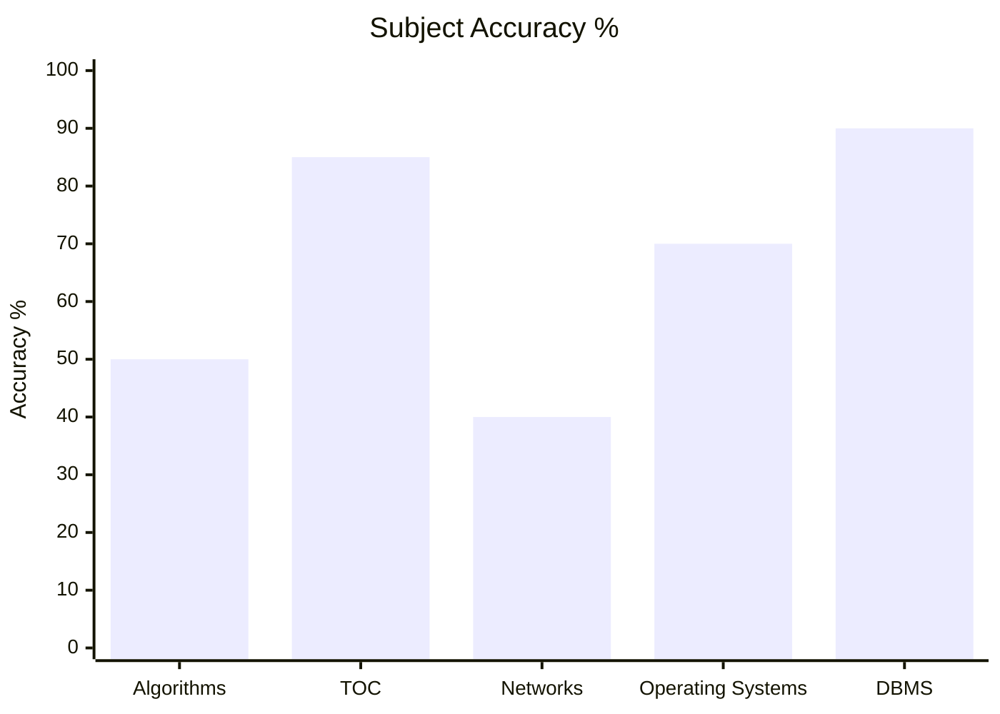
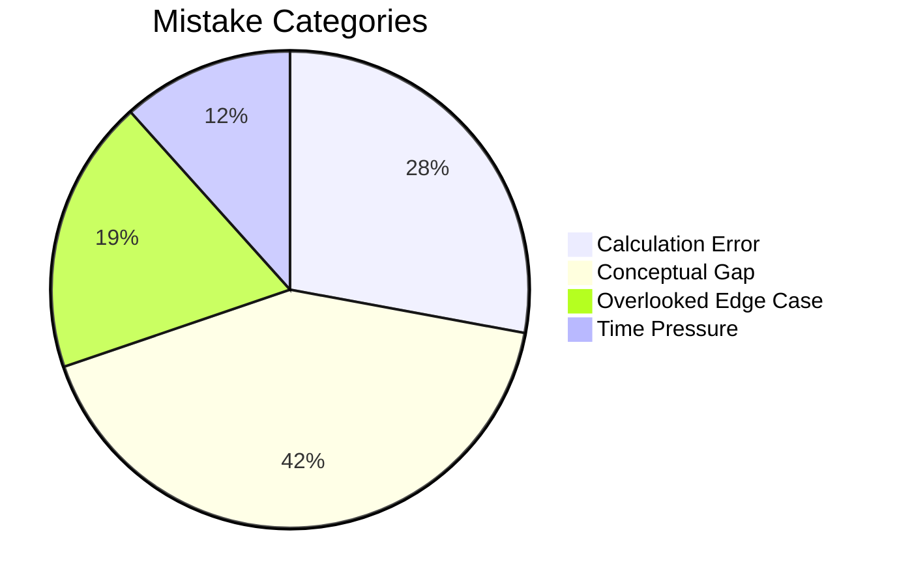

# GATE CS

## Performance

### Subject Accuracy %

### Mistake Categories

---

## Subjects
- [[content/gate-cs/algorithms/index|Algorithms]]
- [[content/gate-cs/theory-of-computation/index|Theory of Computation]]
- [[content/gate-cs/computer-networks/index|Computer Networks]]
- [[content/gate-cs/operating-systems/index|Operating Systems]]
- [[content/gate-cs/dbms/index|DBMS]]

---

## Navigation
- [[content/exams_config|Exams Config]]
