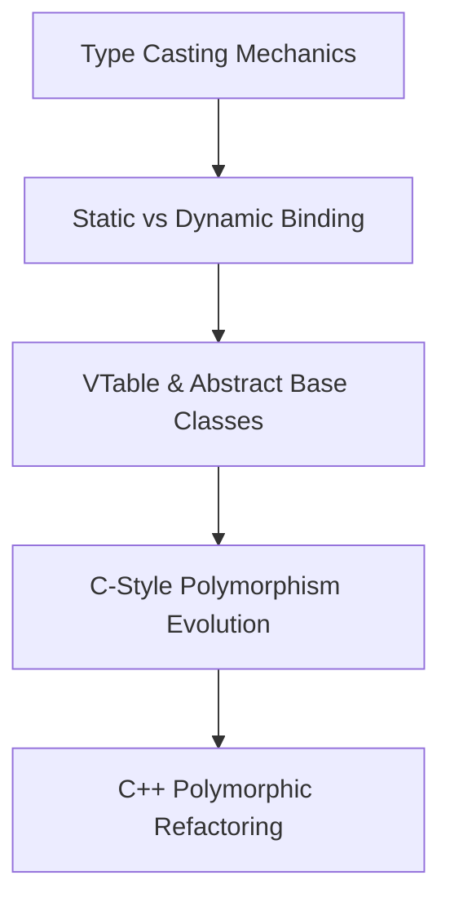

---
aliases:
  - cpp-polymorphism-moc
  - mocs/cpp-polymorphism-moc
  - content/mocs/cpp-polymorphism-moc
title: C++ Polymorphism & Object-Oriented Architecture Map of Content (MOC)
tags: [cpp, oop, polymorphism, architecture, sage, moc]
date: 2026-09-14
---

# 🚀 C++ Polymorphism & Object-Oriented Architecture (MOC)

Welcome to the central Map of Content for **Modern C++ Polymorphism & OOP Architecture**. This learning path transforms dry, complex OOP mechanics into intuitive, first-principles mastery. Every concept is broken down with historical intuition, memory layouts, modern C++ idioms (RAII, vtable mechanics, RTTI, factory pattern), and theoretical/practical guarantees.

---

## 📌 Core Modules & Atomic Notes

### 1. [[type-casting-mechanics|1. Type Casting Mechanics & Class Hierarchy Transitions]]
* **Concepts Covered**:
  * Type System Safety, Value Conversions, Promotion vs Demotion
  * Pointer Reinterpretation & Implicit vs Explicit Casting
  * Inheritance Casting: Upcasting (Safe/Implicit) vs Downcasting (Unsafe/Explicit)
  * Modern C++ Named Casts (`static_cast`, `dynamic_cast`, `reinterpret_cast`, `const_cast`)
* **Idioms & Patterns**: Upcast Substitution Principle, Safe Downcasting with RTTI.

---

### 2. [[static-vs-dynamic-binding|2. Static vs Dynamic Binding & Virtual Dispatch]]
* **Concepts Covered**:
  * Static Type vs Dynamic Type of Pointers and References
  * Compile-Time (Early) Binding vs Run-Time (Late/Dynamic) Binding
  * Function Overloading vs Method Overriding & Hiding Mechanics (`using` declaration resolution)
  * Polymorphic Types & `virtual` Member Functions
* **Idioms & Patterns**: Non-Virtual Interface (NVI) Pattern, Method Hiding Suppression.

---

### 3. [[vtable-abstract-base-classes|3. VTable Architecture, Virtual Destructors & Abstract Base Classes]]
* **Concepts Covered**:
  * Under-the-Hood VTable (`vptr` + `vtbl`) Binary Memory Layout & Dispatch Overhead
  * The Virtual Destructor Mandate & Memory Leak Prevention in Polymorphic Deletion
  * Pure Virtual Functions (`= 0`) & Abstract Base Classes (ABC)
  * Interface Segregation, Pure Interfaces, and Partial Implementations
* **Idioms & Patterns**: Virtual Destructor Idiom, Interface Class Idiom.

---

### 4. [[c-style-polymorphism-evolution|4. Evolution of Polymorphism: C-Style Tagged Unions & Function Switches]]
* **Concepts Covered**:
  * Case Study: Staff Salary Processing System Requirements
  * Procedural Design in C: Tagged `union`/`struct` and Enum Type Discriminators
  * Manual Type Switch Statements (`switch(type)` / `if-else` cascades)
  * Fragility, Lack of Encapsulation, Maintenance Bottlenecks, and OCP Violations in C
* **Idioms & Patterns**: Tagged Union / Discriminator Union Pattern in C.

---

### 5. [[cpp-polymorphism-refactoring|5. Refactoring to C++ Polymorphic Hierarchy & Architectural Evolution]]
* **Concepts Covered**:
  * Stage 1: Non-Polymorphic C++ Class Hierarchy (Encapsulation without Dynamic Dispatch)
  * Stage 2: Polymorphic Hierarchy with Virtual Functions (Open-Closed Principle Compliance)
  * Stage 3: Abstract Base Class Refactoring (`Employee` / `Staff` Abstract Interface)
  * Stage 4: Extensible Manager-Collection Architecture & Factory Idioms
* **Idioms & Patterns**: Object Factory Pattern, Container of Pointers / Smart Pointer Collection (`std::vector<std::unique_ptr<Employee>>`).

---

## 🎯 Quick Navigation & Learning Flow

---

## 💡 Key C++ Idioms Covered Across Notes
1. **RAII (Resource Acquisition Is Initialization)**
2. **Virtual Destructor Idiom**
3. **Non-Virtual Interface (NVI) Pattern**
4. **Object Factory Pattern**
5. **Discriminator / Tagged Union (C Procedural Dispatch)**
6. **Smart Pointer Container Idiom (`std::vector<std::unique_ptr<T>>`)**